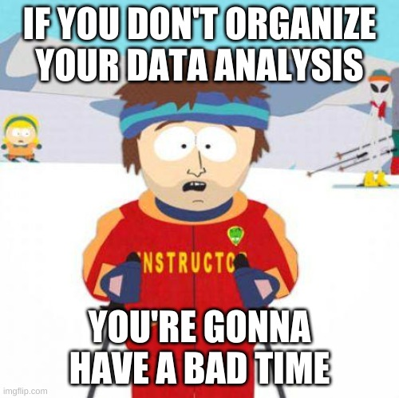
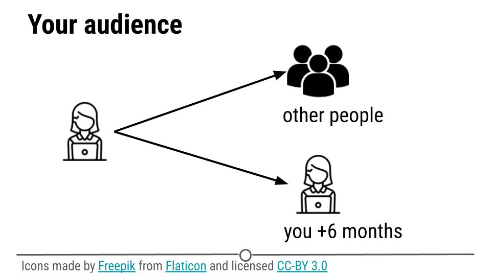
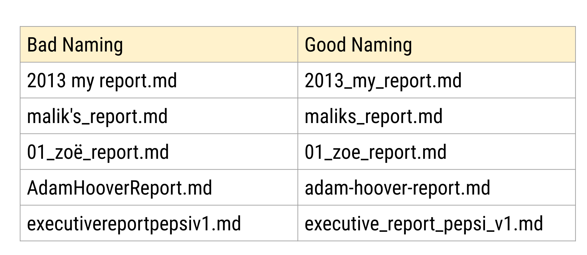
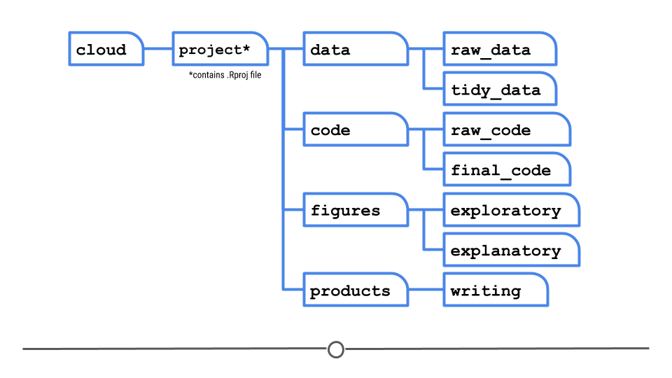
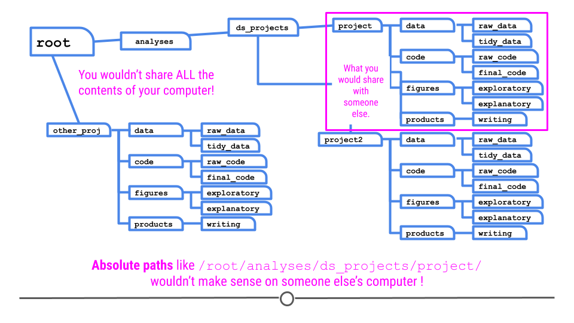
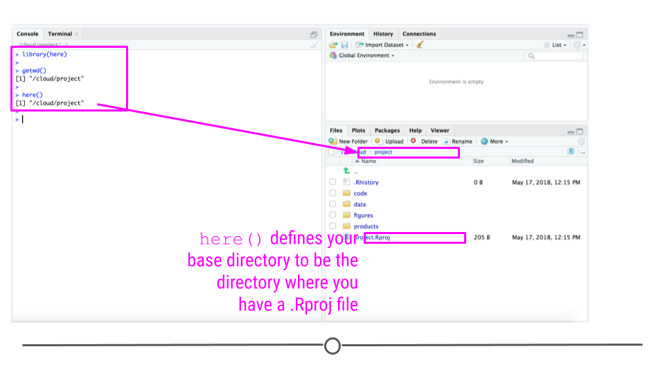
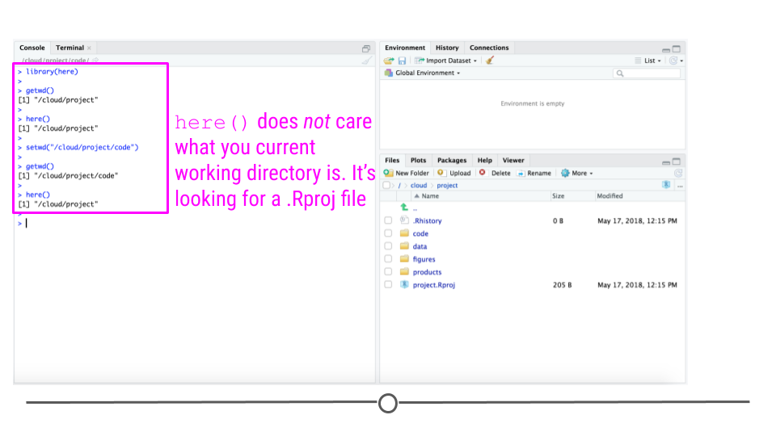
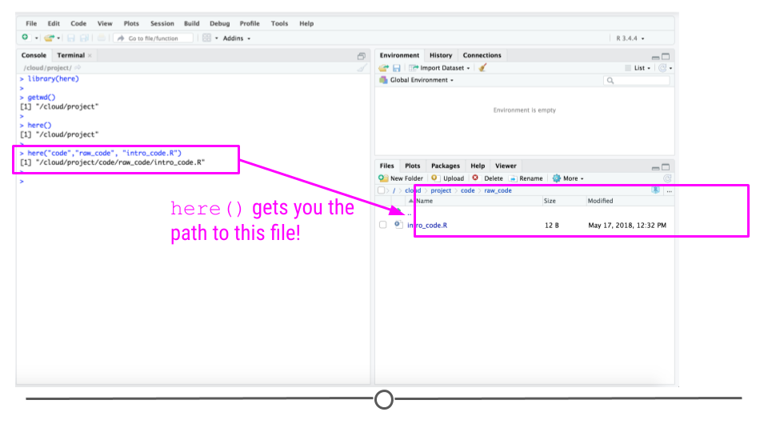

--- 
pagetitle: "Week 3 - Organizing a data analysis"
---

# Week 3

## Week 3 Learning Objectives

:::keyidea
At the end of this lesson you will be able to: 

* Organize a data analysis
* Use appropriate file naming
* Develop and apply a coding style
* Distinguish raw from processed data 
* Apply the chain of custody model for data
:::

## Organizing a data analysis

This week we will focus on organizing a data analysis from high level to low level. An important thing to keep in mind is that this is *one* system for doing this, it is not the *only* system for data analysis organization. The key idea here is just to be consistent in everything you do - from folder structure, to file names, to data columns, and more. This will slow you down a bit as you do your analysis! That's ok! You will more than make up for the time somewhere down the line when you have to repeat or reproduce an analysis. As Karl Broman [puts it](https://kbroman.org/AdvData/12_collab_eda.pdf) the key steps are: 

:::keyidea
* Step 1: slow down and document.
* Step 2: have sympathy for your future self.
* Step 3: have a system
:::

### Motivation - the stick 

This is an advanced data science class. You'd think that the most important parts of advanced data science would focus on complicated methods like deep learning, or managing massive scale data sets. But the reality is that the primary measure of how well or poorly a data analysis goes comes down to organization and management of data, code, and writing. 

This is going to seem pretty simple for an advanced course, but is remarkably one of the things most commonly left out of courses. If you focus on setting your analysis well up from the start you'll have a much better time! 

The classic example of what can go wrong with a poorly organized, documented data analysis is the [Duke Saga](https://www.economist.com/science-and-technology/2011/09/10/an-array-of-errors). In this case, a group of scientists at Duke developed a statistical model that appeared to precisely predict patient response to chemotherapy based on gene expression measurements. This seemed like a huge precision medicine success and resulted in several high profile publications: 

Unfortunately, it turns out there were a lot of problems with the analysis. Some of them were very obvious problems - things like the analysts used probability incorrectly in their calculations. But many of the *most* important problems were things like row-names shifting due to Excel and mis-labeled values for variables (things like coding 0 = responded, 1= not responded, when it was actually the reverse). These mistakes were ultimately detailed in a statistical paper: 

This paper was one of the fastest reviewed in the history of statistics! The reason was that by the time this paper was published, there were already clinical trials ongoing where patients were being assigned the wrong therapy on the basis of this flawed data analysis! 

How could clinical trials have gotten started so quickly?! The reason is that it actually took almost 3 years (!) for the statisticians reproducing the paper to get all of the code and data together so that they could reverse engineer the problems with the analysis. 

It turns out there were a lot of problems with this case, from scientific, to cultural, to statistical - that led to the eventual bad clinical trial. This case was so bad that the scientists and administrators involved even faced lawsuits. 

Obviously most data analyses aren't this high risk! But the real problems here were due to a lack of organization and sharing of the original research materials for the data analysis that identified the chemotherapy predictors. Had the analysts used an organized data analysis many of these problems could be avoided. 

If you want a *highly entertaining* review of the entire Duke Saga by one of the statisticians involved in identifying the errors (and one of the most entertaining statistical speakers out there) you can watch this [video of a talk he gave](http://www.birs.ca/events/2013/5-day-workshops/13w5083/videos/watch/201308141121-Baggerly.html). 

### Motivation - the carrot

When you perform a data analysis the audience is either someone else or you at some time in the future. 

As we mentioned last week the most common query from a collaborator, manager, or executive when you perform an analysis is:

> Could you just re-run that code with the [latest/different/best] parameters?

So even when you think you are doing an analysis for someone else, your code is actually most often just for you at some point in the future. 

When you first get started analyzing data you may have one project or two that you are working on. You will know where all the files are and what they all mean. But as you go on in your career, you will accumulate more analyses and each one will have a large number of code, data, and writing files. This isn't a big problem at first, but later when someone asks you to find, reproduce, or share a piece of analysis from a paper 10 years ago, you'll be so grateful to your past self for being organized! 

## Project Organization

At a high level when you are organizing a data analysis project you need to manage data, code, writing, and analysis products (figures, tables, graphics). When I set up a new project I usually use a single folder with a structure like this. 

* README.md
* .gitignore
* project.Rproj
* data/
  * raw_data/
  * tidy_data/
  * codebook.md
* code/
  * raw_code/
  * final_code/
* figures/
  * exploratory_figures/
  * explanatory_figures/
* products/
  * writing/

### README.md

This is maybe the most critical piece of any data analysis that you are working on. You absolutely *will* forget which files were the original data, which code you used to clean the data with, that one really weird quik that means you have to run `clean_data.R` before `preprocess_data.R` and many other small details. If you keep a steady record of these changes as you go it will be *much* easier to reproduce, share, or manage your analysis. This could save future you hundreds or thousands of hours of repetitive and frustrating work. 

### .gitignore

This file is critical. It tells you which files for Github to ignore when you are pushing to the web. The files that you should make sure you ignore are:

* Any data files that contain PII or HIPAA protected data
* Any files that contain access keys or tokens to databases or services
* Any big data or image files (> 25 MB) 

It is particularly important that you make sure you don't push access keys or private data to Github where they can be accessed publicly. Generally when I have data or keys like these I need to protect I create an additional folder `project/private` that contains these files. I then add _private/*_ to my .gitignore folder so that all the files in this folder are ignored. I push the .gitignore file to Github before I put anything in the private folder. Then, because I'm always paranoid about these things, I generally put a more innocuous file in the private folder and push to test to make sure it is ignored. 

### data/

#### The components of a data set

The work of converting the data from raw form to directly analyzable form is the first step of any data analysis. It is important to see the raw data, understand the steps in the processing pipeline, and be able to incorporate hidden sources of variability in one's data analysis. On the other hand, for many data types, the processing steps are well documented and standardized. 

These are the components of a processed data set: 

1. The raw data.
2. A tidy data set.
3. A code book describing each variable and its values in the tidy data set.
4. An explicit and exact recipe you used to go from 1 -> 2,3

#### data/raw_data/

It is critical that you include the rawest form of the data that you have access to. Here are some examples of the raw form of data:

1. The strange binary file your measurement machine spits out
2. The unformatted Excel file with 10 worksheets the company you contracted with sent you
3. The complicated JSON data you got from scraping the Twitter API
4. The hand-entered numbers you collected looking through a microscope

You know the raw data is in the right format if you:

* Ran no software on the data
* Did not manipulate any of the numbers in the data
* You did not remove any data from the data set
* You did not summarize the data in any way

If you did any manipulation of the data at all it is not the raw form of the data. Reporting manipulated data as raw data is a very common way to slow down the analysis process, since the analyst will often have to do a forensic study of your data to figure out why the raw data looks weird.

#### data/processed_data

The general principles of tidy data are laid out by Hadley Wickham in this paper and this video. The paper and the video are both focused on the R package, which you may or may not know how to use. Regardless the four general principles you should pay attention to are:

* Each variable you measure should be in one column
* Each different observation of that variable should be in a different row
* There should be one table for each "kind" of variable
* If you have multiple tables, they should include a column in the table that allows them to be linked

While these are the hard and fast rules, there are a number of other things that will make your data set much easier to handle. First is to include a row at the top of each data table/spreadsheet that contains full row names. So if you measured age at diagnosis for patients, you would head that column with the name AgeAtDiagnosis instead of something like ADx or another abbreviation that may be hard for another person to understand.

Here is an example of how this would work from genomics. Suppose that for 20 people you have collected gene expression measurements with RNA-sequencing. You have also collected demographic and clinical information about the patients including their age, treatment, and diagnosis. You would have one table/spreadsheet that contains the clinical/demographic information. It would have four columns (patient id, age, treatment, diagnosis) and 21 rows (a row with variable names, then one row for every patient). You would also have one spreadsheet for the summarized genomic data. Usually this type of data is summarized at the level of the number of counts per exon. Suppose you have 100,000 exons, then you would have a table/spreadsheet that had 21 rows (a row for gene names, and one row for each patient) and 100,001 columns (one row for patient ids and one row for each data type).

If you are sharing your data with the collaborator in Excel, the tidy data should be in one Excel file per table. They should not have multiple worksheets, no macros should be applied to the data, and no columns/cells should be highlighted. Alternatively share the data in a CSV or TAB-delimited text file.

#### data/codebook.md

For almost any data set, the measurements you calculate will need to be described in more detail than you will sneak into the spreadsheet. The code book contains this information. At minimum it should contain:

* Information about the variables (including units!) in the data set not contained in the tidy data
* Information about the summary choices you made
* Information about the experimental study design you used

In our genomics example, the analyst would want to know what the unit of measurement for each clinical/demographic variable is (age in years, treatment by name/dose, level of diagnosis and how heterogeneous). They would also want to know how you picked the exons you used for summarizing the genomic data (UCSC/Ensembl, etc.). They would also want to know any other information about how you did the data collection/study design. For example, are these the first 20 patients that walked into the clinic? Are they 20 highly selected patients by some characteristic like age? Are they randomized to treatments?

A common format for this document is a Word file. There should be a section called "Study design" that has a thorough description of how you collected the data. There is a section called "Code book" that describes each variable and its units.

#### The instruction list/script

You may have heard this before, but reproducibility is kind of a big deal in computational science. That means, when you submit your paper, the reviewers and the rest of the world should be able to exactly replicate the analyses from raw data all the way to final results. If you are trying to be efficient, you will likely perform some summarization/data analysis steps before the data can be considered tidy.

The ideal thing for you to do when performing summarization is to create a computer script (in R, Python, or something else) that takes the raw data as input and produces the tidy data you are sharing as output. You can try running your script a couple of times and see if the code produces the same output.

In many cases, the person who collected the data has incentive to make it tidy for a statistician to speed the process of collaboration. They may not know how to code in a scripting language. In that case, what you should provide the statistician is something called pseudocode. It should look something like:

* Step 1 - take the raw file, run version 3.1.2 of summarize software with parameters a=1, b=2, c=3
* Step 2 - run the software separately for each sample
* Step 3 - take column three of outputfile.out for each sample and that is the corresponding row in the output data set

You should also include information about which system (Mac/Windows/Linux) you used the software on and whether you tried it more than once to confirm it gave the same results. Ideally, you will run this by a fellow student/labmate to confirm that they can obtain the same output file you did.

### code/

#### code/raw_code

When you start out doing an analysis recall that you will be doing exploration and data cleaning. Unless you have worked with this type of data before, you will be acting like the blind men and the elephant - just trying to figure out the different aspects of the data set. 

The important characteristics of this stage of an analysis are speed and comprehensiveness. You will want to make many plots, tables, and summaries of the data. You will generally not be trying to make these clean or organize the results. This is ok! You can put these (often slightly unorganized) R scripts in the `code/raw_code` folder. While these scripts are generally unorganized two things will save you a lot of time later:

1. Make sure you comment your code, even if it is really fast/simple comments. Especially highlight any important discoveries/plots you think might be useful later with labeled comments. 

2. If you find anything really important that you definitely will include in downstream analysis add a note to your README.md file about the nature of the discovery and which file you discovered it in, so you can find it later. 

#### code/final_code

Your raw code is mostly for *you* - to help you figure out a data set, start to scope your analysis, and organize your thoughts. Your final code is for *other people* or *future you*. Final code should be organized, easy to follow, and reproducible. Final code is like a curation of your original raw code. You shouldn't keep every plot, figure, summary or table from your raw code in your final code. Only the ones that are important and are part of the story. 

Some important principles of final code are:

1. Files should be ordered so it is easy to follow the flow of an analysis (see file naming section for more)
2. You should use relative, rather than absolute, paths for all coding within your final code (see section on relative vs absolute paths below)
3. If you randomly sample data, or use methods like k means clustering or random forests that are inherently stochastic, you should set a seed so that calculations can be reproduced exactly. 
4. Final code files should either be in R markdown format or heavily commented so it is easy to follow all the steps in ana analysis. 

### figures

We will have an entire week focused on just figures, so for now we will briefly explain these two folders, but more will be coming soon! 

#### figures/exploratory_figures

Exploratory figures are figures that are made rapidly to determine the structure, quirks, and summaries of the data that will be important for downstream analysis. The important thing about exploratory figures is that you should make a lot of them! Exploratory figures are like raw code, they are mostly for you. You should save any figure you make that you think could be useful for you later. You should still maintain good file naming practices and include comments in your raw code that point out which code produces which exploratory figure. 

#### figures/explanatory_figures

Explanatory figures, like final code, is for sharing with others. You will generally make many fewer explantory figures than exploratory figures, they will generally be much more polished, and you will want to make sure that they clearly follow the "arc" of the data analysis you are performing. Since this is a folder you will be sharing with others, it is a good idea to include documentation in your README.md explaining what these figures are and which code in the `code/final_code` folder makes these figures.  

### products/

This folder is for any complete data analytic products you will be sharing with your collaborators, manager, or audience. For our class, we will be primarily focusing on written data analyses so the main folder we include is `products/writing` but you may also include folders such as `products/presentations`, `products/shinyapps`, or `products/dashboards` if they are more appropriate for the type of sharing you are performing. 

#### products/writing

This folder will contain written documents you are sharing with collaborators. They may be Word documents, links to Google Docs, or Latex documents. Sometimes it will be possible for one of your .Rmd files to compile directly to these documents, but it is more common that these will be passed back and forth with collaborators. It is good to separate these writing files from those that you are managing and organizing for the broader data analysis. 

## File naming

[Jenny Bryan](https://jennybryan.org/), one of the world's best data scientists says that: 

> File organization and naming are powerful weapons against chaos. 

If this looks familiar, you may want to update your file naming approach! 

She has outlined some key principles for naming files. While these principles are especially useful for final code, they are also useful for naming data files, for naming raw code, and for naming figures and writing. The principles are that files should be:  

* Machine readable
* Human readable
* Be nicely ordered

Machine readable means that file names shouldn't contain spaces, special characters, and should include important pieces of information about the file contents (sometimes called slugs) separated by underscores or dashes so that it is easy to run computer code to search for specific files. It is often easier if file names are entirely lowercase letters to avoid simple coding errors. 

Human readable means that files should be labeled with names that make it easy for a person to follow along. So err on the side of long file names rather than abbreviations, numeric only file names, or obscure file names. 

When you open a folder - especially the final code folder - it is useful to see the files in the order you want them to be run. One way to do this is to name files alpha-numerically so that they will appear in the right order on your computer. One way to do this is to order the files and then append a number to the beginning of each file name (like `01_data_cleaning.R`, `02_exploratory_analysis.R` etc. so that the files will be ordered correctly). Here are some examples of good and bad names for files - can you figure out why the bad file names are bad? 

As an example, here are two data files from an analysis I worked on. 

> processed_pvalue_data_from_pubmed_oct24.rData
> raw_pvalue_data_from_pubmed_oct24.rData

The first part of the file name tells you what I did to the data: 

> **processed**_pvalue_data_from_pubmed_oct24.rData
> **raw**_pvalue_data_from_pubmed_oct24.rData

the second part of the file name tells you what kind of data it is:  

> processed_**pvalue_data_from_pubmed**_oct24.rData
> raw_**pvalue_data_from_pubmed**_oct24.rData

and the last part tells you the date I pulled the data:

> processed_pvalue_data_from_pubmed_**oct24**.rData
> raw_pvalue_data_from_pubmed_**oct24**.rData

These file names are human readable, machine readable (you can sort by processing type, etc.), and they are nicely ordered if you care about the data processing as the main ordering variable. 

## Absolute vs. relative paths

An important reason you are organizing your data analysis files is that you will often have to share the files with others. One thing to keep in mind is that when you share files with others *they are no longer on your computer*. This means that if you give your code to someone else, they will need to be able to find the files, data, and code within the folders you have created inside your project. 

Imagine for example that you have set up your folder structure like this: 

The reality is that while you will share only this one folder with someone else; it is on your computer somewhere and might be buried deep in your folder structure. 

The important thing to realize is you have to specify files you call in your analysis so they can be found by others. So if you source a file like this:

* `source('C:\Documents\ds_projects\project\code\final_code\myfile.R')`
* `source('/root/analyses/ds_projects/project/code/final_code/myfile.R')`

Then it won't work on someone else's computer since they don't have that same file structure! 

To avoid this, you should use relative paths, which specify the file path to a folder relative to the project folder. You can do that with the [here](https://cran.r-project.org/web/packages/here/index.html) package in R. The here package looks for a .Rproj file and points to that directory: 

The nice thing about the `here` function finds the base folder regardless of which folder you are in inside the project directory: 

You can use the here function to define paths in your code to code or data files: 

So for example if your working directory is `/root/analyses/ds_projects/project/` and you run the code: 

`here('code/final_code/myfile.R')`

it will produce the file path: 

`/root/analyses/ds_projects/project/code/final_code/myfile.R`

and if you are on a different computer and your working directory is `C:\Documents\ds_projects\` and you run the code: 

`here('code/final_code/myfile.R')`

it will produce the file path: 

`C:\Documents\ds_projects\project\code\final_code\myfile.R`

In other words, here will produce the complete path to your `myfile.R` file, *relative* to the directory where you have stored .Rproj. This means that regardless of where a person puts the folder on their computer, the here function will be able to create the path to the data. 

The optimal way to take advantage of this package is to use [Rstudio projects](https://support.rstudio.com/hc/en-us/articles/200526207-Using-Projects) but you can use the `set_here()` function to create a .here file that will function as if it was the .Rproj file for targeting the here function.  

## Coding Variables

When you put variables into a spreadsheet there are several main categories you will run into depending on their data type:

* Continuous
* Ordinal
* Categorical
* Missing
* Censored

Continuous variables are anything measured on a quantitative scale that could be any fractional number. An example would be something like weight measured in kg. Ordinal data are data that have a fixed, small (< 100) number of levels but are ordered. This could be for example survey responses where the choices are: poor, fair, good. Categorical data are data where there are multiple categories, but they aren't ordered. One example would be sex: male or female. Missing data are data that are missing and you don't know the mechanism. You should code missing values as NA. Censored data/make up/ throw away missing observations.

In general, try to avoid coding categorical or ordinal variables as numbers. When you enter the value for sex in the tidy data, it should be "male" or "female". The ordinal values in the data set should be "poor", "fair", and "good" not 1, 2 ,3. This will avoid potential mixups about which direction effects go and will help identify coding errors.

Always encode every piece of information about your observations using text. For example, if you are storing data in Excel and use a form of colored text or cell background formatting to indicate information about an observation ("red variable entries were observed in experiment 1.") then this information will not be exported (and will be lost!) when the data is exported as raw text. Every piece of data should be encoded as actual text that can be exported.

:::resources
One very good approach to naming columns in a data analysis are with multiple levels as described in this great [blog post by Emily Riederer](https://emilyriederer.netlify.app/post/column-name-contracts/). For example your variable names might include:

* A slug for the type of variable (ID for ids, IND for indicators, N for counts, etc.)
* A slug for subjects being measured (DRIVER for drivers, RIDER for riders etc.)
* A slug for what is being measured (CITY, ZIPCODE, etc)

which turns into data column names like: 

* ID_DRIVER
* N_TRIP_PASSENGER_ORIGIN_DESTINATION

The blog post contains much more information on this approach. 
:::

## Project management software

The approach we discussed here to managing a project can be done by hand or by copy pasting each time you create a new project. It has some advantages - it is lightweight and focused on organization - so you don't depend on any outside software. 

That being said there are some important pieces of software that have been developed for project management in R. These packages can help automate some of the processes that make data project management difficult. 

:::resources
* [drake](https://docs.ropensci.org/drake/)- is software for automating pipelines in R, it is smart about knowing which file to run in which order and can be really useful if you have a complicated set of processing scripts that must be run in just the right order to produce your final analysis. 
* [workflowr](https://github.com/jdblischak/workflowr) - is a package for setting up and automating some of the file organization/folder structure described in this lecture. It also contains workflow management functions and can be combined with drake to make workflows automated. 
* [snakemake](https://snakemake.github.io/) is more general purpose workflow automation software. If you are doing lots of processing outside of R, this is probably more useful than drake. 
:::

## Coding style 

While it isn't as critical as some of the other organizing principles we have discussed here, having clean code is really helpful for making it easier for others to follow your analysis. As with many of the other suggestions in this week's lesson, the key principle here is consistency. There are a variety of different coding style definitions you can go with - if you use a popular framework your code will be more easily readable by individuals from that community. 

:::resources
* [Google's R Style Guide](https://google.github.io/styleguide/Rguide.html)
* [Tidyverse Style Guide](https://style.tidyverse.org/)
* [Bioconductor Style Guide](https://bioconductor.org/developers/how-to/coding-style/)
:::

## Chain of Custody for Data

"Raw data" is one of those terms that everyone in statistics and data science uses but no one defines. For example, we all agree that we should be able to recreate results in scientific papers from the raw data and the code for that paper. 

> But what do we mean when we say raw data? 

When working with collaborators or students I often find myself saying - could you just give me the raw data so I can do the normalization or processing myself. To give a concrete example, I work in the analysis of data from [high-throughput genomic sequencing experiments](http://www.nature.com/nbt/journal/v26/n10/full/nbt1486.html). 

These experiments produce data by breaking up genomic molecules into short fragements of DNA -  then reading off parts of those fragments to generate "reads" - usually 100 to 200 letters long per read. But the reads are just puzzle pieces that need to be fit back together and then quantified to produce measurements on DNA variation or gene expression abundances. 

[Image from Hector Corrata Bravo's lecture notes](http://cbcb.umd.edu/~hcorrada/CFG/lectures/lect22_seqIntro/seqIntro.pdf)

When I say "raw data" when talking to a collaborator I mean the reads that are reported from the sequencing machine. To me that is the rawest form of the data I will look at. But to generate those reads the sequencing machine first (1) created a set of images for each letter in the sequence of reads, (2) measured the color at the spots on that image to get the quantitative measurement of which letter, and (3) calculated which letter was there with a confidence measure. The raw data I ask for only includes the confidence measure and the sequence of letters itself, but ignores the images and the colors extracted from them (steps 1 and 2). 

So to me the "raw data" is the files of reads. But to the people who produce the machine for sequencing the raw data may be the images or the color data. To my collaborator the raw data may be the quantitative measurements I calculate from the reads. When thinking about this I realized an important characteristics of raw data. 

> Raw data is relative to your reference frame.

In other words the raw data is raw to _you_ if you have done no processing, manipulation, coding, or analysis of the data. In other words, the file you received from the person before you is untouched. But it may not be the _rawest_ version of the data. The person who gave you the raw data may have done some computations. They have a different "raw data set". 

The implication for reproducibility and replicability is that we need a "chain of custody". The chain of custody model states that each person must keep a copy of the raw data and a complete record of the operations they performed to arrive at their version of processed data. As long as each person follows these steps, then the data will be  

As long as each person keeps a copy and record of the "raw data" to them you can trace the provencance of the data back to the original source. 

## Version Control

Typically when you are working on data analysis files, you will have to update them over and over again. One way to handle this is to save a new file each time like in this comic from [PhD Comics](http://phdcomics.com/)

This is a ....bad idea. You should instead use a version control system that will keep track of the changes to your files. The unfortunate truth about version control though is that most version control systems can be frustrating: 

<blockquote class="twitter-tweet">
&quot;Version control is a truly vital concept that has unfortunately been implemented by madmen.&quot; Amen. <a href="https://t.co/wSI7r9Epm7">https://t.co/wSI7r9Epm7</a>
&mdash; mike cook (@mtrc) <a href="https://twitter.com/mtrc/status/617075570761965568?ref_src=twsrc%5Etfw">July 3, 2015</a></blockquote> 

It is as an assumed pre-requisite for this class that you know how to use a version control system like Github. That being said there are a number of good tutorials out there for using Git/Github both with R and more generally. I highly recommend, for example, that you check out [Happy Git and Github for the UseR](https://happygitwithr.com/). 

## Additional Resources

:::resources
* [Organizing Data Science Projects](https://leanpub.com/universities/courses/jhu/cbds-organizing)
* [Happy Git and Github for the UseR](https://happygitwithr.com/)
* [How to name files](https://speakerdeck.com/jennybc/how-to-name-files)
* [Coordinating with collaborators](https://kbroman.org/AdvData/12_collab_eda.pdf)
:::

## Homework 

:::homework
* __Template Repo__: https://github.com/advdatasci/homework3
* __Repo Name__: homework3-ind-yourgithubusername
* __Pull Date__: 2020/09/21 9:00AM Baltimore Time 
:::
