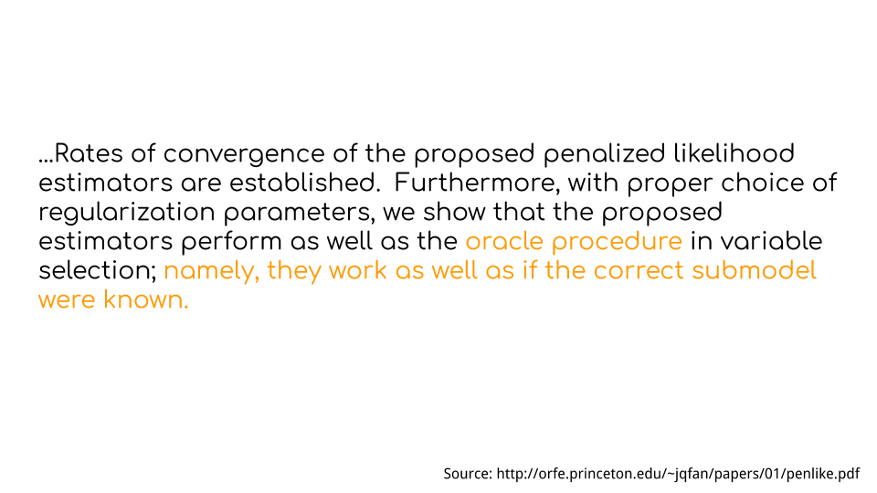
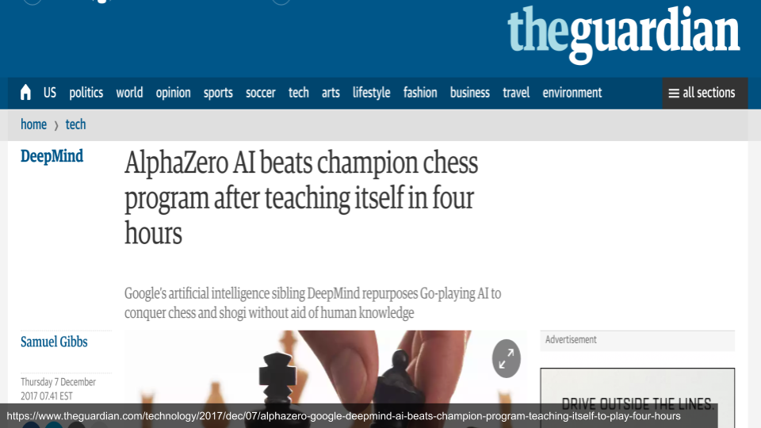
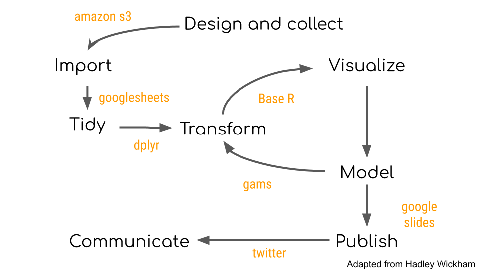
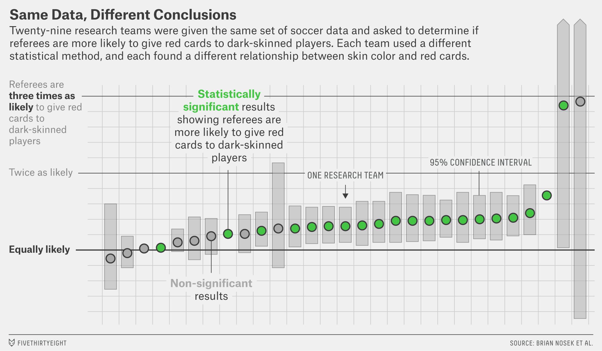
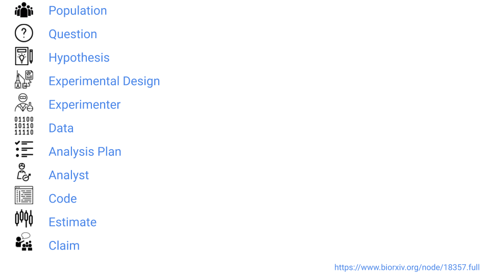
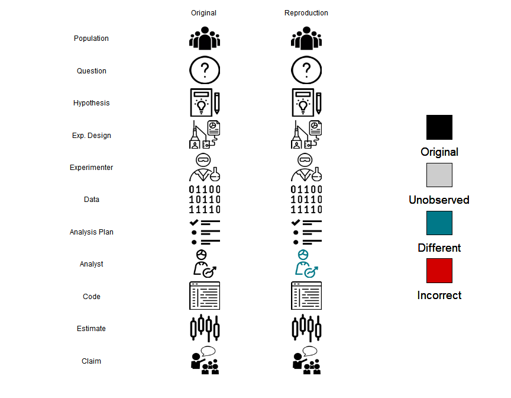
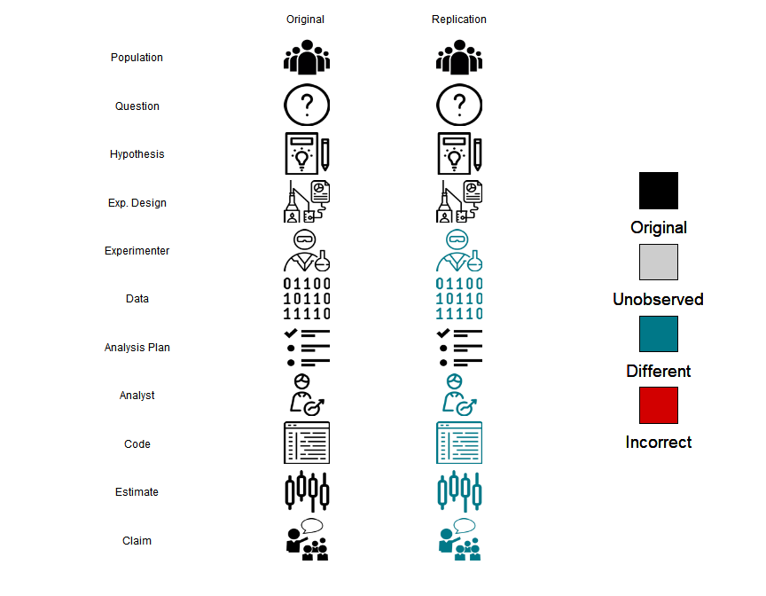
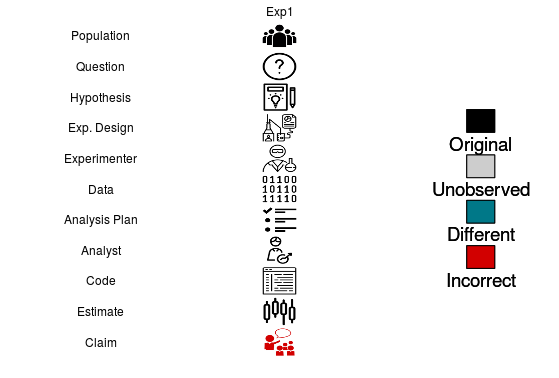
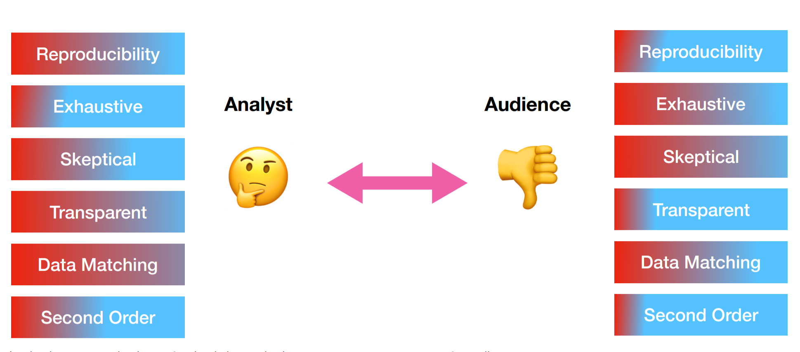

--- 
pagetitle: "Week 4 - Defining success in data science"
---

# Week 4

## Week 4 Learning Objectives

:::keyidea
At the end of this lesson you will be able to: 

* Describe the optimality paradox
* Define reproducibility and replicability 
* Identify the elements of a data analysis
* Identify the principles of a data analysis
* Match elements to principles in a data analysis

:::

## The optimality paradox

Over the last several decades statistical and machine learning methods have been steadily improving. It is common to see statements like this in [statistical methods papers](http://orfe.princeton.edu/~jqfan/papers/01/penlike.pdf): 

At the same time, machine learning methods are also dramatically improving and with larger training sets, clever training algorithms, and sophisticated optimization can now perform tasks - like mastering the [game of GO](https://en.wikipedia.org/wiki/Go_(game)) - that were previously thought to be impossible. Google's [AlphaZero](https://www.theguardian.com/technology/2017/dec/07/alphazero-google-deepmind-ai-beats-champion-program-teaching-itself-to-play-four-hours) even taught itself to beat the best chess programs in the world! 

So this seems to suggest that we are converging on a point where all data analysis will be a solved problem - optimally performed by machines and always arriving at the correct answer. So I guess maybe not the best time to be learning about data science, right? 

However, at the same time we see these incredible technical successes, there are also some more troubling trends. For example, you may have heard of the ['reproducibility crisis'](https://www.scientificamerican.com/video/is-there-a-reproducibility-crisis-in-science/). 

Or you might have heard the suggestion that [most published research findings are false](https://qz.com/530064/most-science-research-findings-are-false-heres-how-we-can-change-that/)

More insidiously you have probably heard of the ways that machine learning and data analysis have been used to encode [sexist](https://www.reuters.com/article/us-amazon-com-jobs-automation-insight/amazon-scraps-secret-ai-recruiting-tool-that-showed-bias-against-women-idUSKCN1MK08G) and [racist](https://www.propublica.org/article/machine-bias-risk-assessments-in-criminal-sentencing)  behavior in algorithms. 

So maybe the robots haven't come for all of our data analysis and data science jobs just yet? 

:::keyidea
The optimality paradox at the heart of data science is that data science tools, statistical methods, and machine learning techniques are increasingly optimal and sophisticated, but the data analyses created with those tools, methods and techniques are increasingly suspect. 
:::

The heart of the optimality paradox is that data analysis, for better or worse, is still as much an art as it is a science. In this week's lecture we will discuss different dimensions of a successful data analysis - from reproducibility, to communication, to a definition of "correct". 

## An example of the art of data science

To illustrate the art of data science I'm going to select a data scientist at random from all the data scientists in the world - my co-instructor [Roger Peng](http://www.biostat.jhsph.edu/~rpeng/). 

Roger and his co-authors wrote a [really important](https://jamanetwork.com/journals/jama/article-abstract/202503) paper on the relationship between PM 2.5 and particulates and hospital admissions. In that paper they describe their main statistical model as follows. 

> "In the first stage, single lag and distributed lag overdispersed Poisson regression models were used for estimating county-specific RRs of hospital admissions associated with ambient levels of PM2.5."

This makes sense as [generalized linear models](https://en.wikipedia.org/wiki/Generalized_linear_model) are considered to be one of the most robust statistical tools for measuring statistical associations with a [whole book](https://www.amazon.com/Generalized-Chapman-Monographs-Statistics-Probability/dp/0412317605) written about their useful and powerful statistical properties. 

Diving a bit further into the methods we observe the following more detailed description of the statistical choices behind this model (colors added by me). 

You'll notice if you read this carefully that each choice coded in orange or blue, was a judgement call made by the authors in writing this paper - from the number of outcomes, to the type of outcomes, to the geographies and context considered. These decisions are likely not backed by tomes of statistical or methodological theory. 

While I said I was picking on someone, there is absolutely nothing wrong with these choices! In fact, they represent an effort to carefully define the scope of the statistical model and deal with all of the pecularities that come up in any real data set. Every single data analysis requires tens to thousands of small decisions like this, each of which may have an impact on the results. 

To bring this a little closer to home, here is a stylized and extended version of the data analysis cycle originally proposed by [Grolemund and Wickham](https://r4ds.had.co.nz/explore-intro.html) labeled with the tools and choices I often make when performing data analysis...

...and if I'm being perfectly honest these are the reasons that I often make these decisions. You'll notice that most of the time the reason isn't some deep scientific or statistical reason, but rather due to convenience, training, or the [sub-culture of the field](https://simplystatistics.org/2015/04/29/data-analysis-subcultures/) I work in.  

The result is that any data analysis I produce will be the product of the tools I use with the decisions I make. Producing accurate data analysis will depend critically on both. 

### An important subtlety - analyst decisions change the question

If you haven’t already read the amazing piece by Christie Aschwanden on why [Science isn’t Broken](https://fivethirtyeight.com/features/science-isnt-broken/) you should do so immediately. It does an amazing job of capturing the nuance of statistics as applied to real data sets and how that can be misconstrued as science being “broken” without falling for the easy “everything is wrong” meme.

One thing that caught my eye was how the piece highlighted a crowd-sourced data analysis of soccer red cards. They asked dozens of independent groups to analyze the relationship between skin color and red-cards. They got answers that varied quite a bit based on the different modeling choices the analysts made. 

The figure and [underlying data](https://osf.io/qix4g/) for this figure are fascinating in that they really highlight the human behavioral variation in data analysis and you can even see some data analysis subcultures emerging from the descriptions of how people did the analysis and justified the use or removal of certain covariates. 

One way to read this figure is that even the best data analysts working on the same data won't come to the same conclusions. But one subtlety of the figure - and of analyst decisions in data science in general - is that not all of the estimates being reported are measuring the same thing. For example, if some groups adjusted for the country of origin of the referees and some did not, then the estimates for those two groups are measuring different things (the association conditional on country of origin or not, respectively). In this case the estimates may be different, but entirely consistent with each other, since they are just measuring different things.

If you ask two people to do the analysis and you only ask them the simple question: 

> Are referees more likely to givered cards to dark skinned players?

You may get a different answer based on those two estimates. But the reality is the answers the analysts are reporting are actually to the questions:

1. Are referees more likely to give  red cards to dark skinned players holding country of origin fixed?
2. Are referees more likely to give  red cards to dark skinned players averaging over country of origin (and everything else)?

The subtlety lies in the fact that changes to covariates in the analysis are actually changing the hypothesis you are studying.

So in fact the conclusions in that figure may all be entirely consistent after you condition on asking the same question. It is always worth thinking carefully about what covariates you include, what processing you do, and what methods you apply - because they may in fact change the question you are answering! 

## Early definitions of success

There are a range of potential definitions of a successful data analysis. Motivated by cases like the [reproducibility failure in precision medicine](https://vimeo.com/16698764) and later [massive scale replication studies](https://science.sciencemag.org/content/349/6251/aac4716) in psychology as well as the claims that [most published research are false](https://journals.plos.org/plosmedicine/article?id=10.1371/journal.pmed.0020124); the original definitions of a successful data analysis focused on three key terms - reproduciblity, replicability and false discoveries. 

These terms have different definitions in different fields and so can be a bit hard to pin down. To make our discussion concrete consider the steps in a scientific study. 

Using these steps we can now define some of the key early ways for defining the success of a data analysis. 

### Reproducibility

We will define reproduciblity as the ability of an independent data analyst to use the data and code from an original analysis and get the same results. Under our simplified model for the scientific steps - this means that a reproducibility study involves keeping every step the same with the exception of the data analyst. In other words, using the original code and data lead to the same numbers as the original analysis. 

Reproducibility is the easiest of these problems to both define and assess. Assessing reproducibility involves checking the published manuscript, looking for published data and code, then comparing the results of that data and code to the published results. If they are the same the study is reproducible, if they are not, then the study is not. 

However, [reproducible research can still be wrong](https://www.pnas.org/content/112/6/1645). For example, the original study behind the precision medicine scandal is now [fully reproducible](https://bioinformatics.mdanderson.org/Supplements/ReproRsch-All/)! But the analysis still produces results that do not correctly match patients to the most useful chemotherapies. 

### Replicability

We will define replicability as the ability of an independent scientific team to repeat an experiment, collect, new data, and arrive at equivalent statistical results. 

Replicability is a more challenging concept to both define and measure. A study replicates if the same experiment can be performed a second time with consistent results. If the data collected during the study are subject to sampling variability then even in the best case scenario the results of a replication will not be identical to the original study. However, we would expect that the results would be within the range of values [predicted by the parameter estimates and variability estimates from the original study](https://www.ncbi.nlm.nih.gov/pmc/articles/PMC4968573/). The difficulties in assessing replicability are compounded by potential for publication bias, regression to the mean, fragility of scientific results to a particular context, and imperfect replication. 

There is now a whole field dedicated to estimating replicability of experiments within scientific subfields from [psychology](https://science.sciencemag.org/content/349/6251/aac4716), to [economics](https://science.sciencemag.org/content/351/6280/1433), to [cancer biology](https://elifesciences.org/collections/9b1e83d1/reproducibility-project-cancer-biology). This is an important line of research, but isn't without its difficulties - in particular it is expensive and difficult to replicate research, it is difficult to define what a true replication means, and the authors of these studies may also be motivated to find that studies don't replicate to increase the impact of their results. 

The bottom line is that for evaluating any individual data analysis it is rare that you will have the motivation, funding, and ability to fully replicate a study to see if the results hold up. 

### False discovery

A false discovery is the most challenging of these three problems to assess. A false discovery means that the reported parameter or answer to a scientific question is not consistent with the underlying natural truth being studied.

A false discovery is the most difficult to assess because we rarely know the true state of nature for any particular scientific study. Single replications are not sufficient to separate true discoveries from false discoveries since both the original study and the replication are subject to sampling error and other potential difficulties with replication studies. Repeated replications or near replications that all point to a similar conclusion are the best way to measure false discoveries in the medical literature. However, repeated replication or near replication of identical hypotheses is very expensive and tends to only occur for highly controversial ideas - such as the claim that vaccines cause autism - which has been [repeatedly disproven](https://www.statnews.com/2019/03/04/vaccines-no-association-autism-major-study/). 

## A theory of data science success

As we pointed out in [Week 1](http://jtleek.com/ads2020/week-1.html) it is easier to think of the theory of data analysis more like the theory of music. It provides guidance and opinions on what is "good" versus what is "bad". An important component of this idea of theory is that it is not prescriptive. It is designed to give some rules that will be useful when considering a new data analysis and evaluating whether it is successful or not. 

However a huge challenge is that there hasn't been a formal theory for what is a good data analysis or not. For example, a very successful data scientist, Daryl Pregibon said: 

> “Throughout American or even global industry, there is much advocacy of statistical process control and of understanding processes. Statisticians have a process they espouse but do not know anything about. It is the process of putting together many tiny pieces, the process called data analysis, and is not really understood."

However, to be able to have a conversation around the quality of an individual data analysis without resorting to multiple, expensive, time-consuming replications we need to come up with a framework for guide-posting what is a "successful" and an "unsuccessful" data analysis. 

The core idea of modern thinking around data analysis is that any data science project has at least two participants - the analyst and the audience. The analyst is the person collecting, organizing, exploring, modeling, and reporting on the data. The audience may be the analysts themselves, or could be a collaborator, manager, or the general public.

:::keyidea
A successful data analysis is one where the analyst and the audience agree on the most important components of the analysis and the analyst performs those components to the expectations of the audience. 
:::

One important component of this definition is that it is _relative_ to the audience in question. This is an uncomfortable thing for people who are naturally trained to be quantitative to process at first. But advanced data science is to a very large extent about identifying both the spoken and unspoken goals of your audience and then designing analytical techniques to meet those goals. 

To make this idea more concrete, we need to identify some key components of a data analysis - the elements and principles of data science.

### Elements of Data Science

According to [Hicks and Peng](https://arxiv.org/pdf/1903.07639.pdf):

> The elements of a data analysis are the fundamental components of a data analysis used by the data analyst: code, code comments, data visualization, non-data visualization, narrative text, summary statistics, tables, and statistical models or computational algorithms 

They include 8 examples of broad categories of data science elements in their paper including narrative text, code, figures, and models. 

These elements may be combined together into three basic data analytic outputs: 

* __Analytic containers__ - which might be a set of files including a Jupyter notebook or R Markdown document, a dataset, and a set of ancillary
code files. The analytic container is essentially the “source code” of the analysis and it is the basis for making modifications to the analysis and for reproducing its findings. 
* __Analytic products__ - which is the executed version of the analysis
in the analytic container, containing the executed code producing the results and output that the analyst chooses to include, which might be a PDF document or HTML file.
* __Analytic presentation__ which might be a slide deck, PDF document, or other presentation format, which is the primary means by which the data analysis is communicated to the audience. 

### Principles of Data Science

According to [Hicks and Peng](https://arxiv.org/pdf/1903.07639.pdf):

> The principles illustrated by a data analysis are prioritized qualities or characteristics that are relevant to the analysis, as a whole or individual components, and that can be objectively observed or measured. Their presence (or absence) in the analysis is not dependent on the characteristics of the audience viewing the analysis, but rather the relative weight assigned to each principle by the analyst can be highly dependent on the audience’s needs. In addition, the weighting of the principles by the analyst can be influenced by outside constraints or resources, such as time, budget, or access to individuals to ask context-specific questions, that can impose restrictions on
the analysis.

In [their paper](https://arxiv.org/pdf/1903.07639.pdf) they define six key principles of a data analysis. 

### Data matching

> Data analyses with high data matching have data readily measured or available to the analyst that directly matches the data needed to investigate a question with data analytic elements

### Exhaustive

> An analysis is exhaustive if specific questions are addressed using multiple, complementary elements 

### Skeptical

> An analysis is skeptical if multiple, related questions are considered using the same data

### Second order

> An analysis is second-order if it includes elements that do not directly address the primary question, but give important context or supporting information to the analysis

### Transparent

> Transparent analyses present an element or subset of elements summarizing or
visualizing data that are influential in explaining how the underlying data phenomena or datageneration process connects to any key output, results, or conclusions

### Reproducible

> An analysis is reproducible if someone who is not the original analyst can take the published code and data and compute the same results as the original analyst.

This is a great start on a set of principles to consider, but is not necessarily exhaustive. One thing to think about is whether there are any principles you think are missing from this list - important general concepts you look for in a data analysis. You may add them to your list of principles when designing your approach. 

## A successful data analysis

We say that a data analysis is successful if the analyst uses elements that appropriately weight each of the principles to match audience expectations.

However, if the elements chosen by the analyst do not appropriately weight the principles according to the audience expectation then the analysis may not be successful. 

So for example, consider the two analyses of the mortality data post hurricane Maria. In the case of a [New England Journal of Medicine paper](https://www.nejm.org/doi/full/10.1056/NEJMsa1803972) there are many second-order analyses to consider sub-questions and secondary questions other than the direct impact of Maria on mortality. However, in the case of a [blog post](https://simplystatistics.org/2018/06/08/a-first-look-at-recently-released-official-puerto-rico-death-count-data/) there is a more direct single track to the analysis. The NEJM article is also more exhaustive. Each analysis could be considered "successful" if the choices made by the analyst met expectations. 

In our course discussions, many people mentioned that they enjoyed the blog post more than the paper since they were able to follow the line of reasoning more direclty. In other words, as an audience member, you down-weighted second order analyses. But others suggested that they preferred the NEJM article because they knew exactly where to look for particularly influential figures or tables - in other words they upweighted transparency. 

When undertaking a new analysis you should consider the principles (either those here, or others you defines for your self) and consider how each component of your analysis contributes to upweight or downweight the principles. Then consider your audience and whether your choices match expectations. 

## Constraints and expectation matching

One key consideration when using the principle weighting  model for data analysis success is that there are often constraints on your analysis. These constraints may be due to your budget, your available time, choices made by people who manage you, or constraints due to the outlet where you plan to communicate. 

This will necessarily mean that you will always have tradeoffs you will need to consider as a data scientist. For example, it would be ideal if every analysis was fully reproducible down to the compiler level. This may even be a principle that your audience weights very highly. However, that level of reproducibility requires significant investment of time and resources. You will need to carefully consider whether you can afford to spend that time on reproducibility or whether you will need to budget your resources across principles.

## What about being correct? 

One thing that is tricky about the principle weighting approach to defining data analysis success is that we don't require an analysis to be "correct" to be successful. This is both due to difficulties in defining what we mean by "correct" and in knowing that the rewards of a data analysis may not always be proportional to measures of accuracy or replicabilitiy. 

Successful analyses may be different from valid, honest, or complete analyses.For example, in academia it is common for some journals to upweight significance of results over transparency, reproducibility, or exhaustiveness. 

Honesty and correctness _are important_ in applying your methods and choosing your data. Data analysis often requires the analyst to be brave; precisely because the success of an analysis may be independent of its honesty. The really successful analysts are able to both match audience expectations and uphold honesty and integrity in their analysis. 

## Additional Resources

:::resources
* [Elements and Principles for Characterizing Variation between Data Analyses](https://arxiv.org/abs/1903.07639)
* [Evaluating the success of a data analysis](https://arxiv.org/abs/1904.11907)
* [Lecture on Elements and Principles](https://jhu-advdatasci.github.io/2019/lectures/03-elements-prinicples-success.pdf)
* [Is most published research really false?](https://www.annualreviews.org/doi/abs/10.1146/annurev-statistics-060116-054104?journalCode=statistics)
:::

## Homework 

:::homework
* __Template Repo__: https://github.com/advdatasci/homework4
* __Repo Name__: homework4-ind-yourgithubusername
* __Pull Date__: 2020/09/28 9:00AM Baltimore Time 
:::
