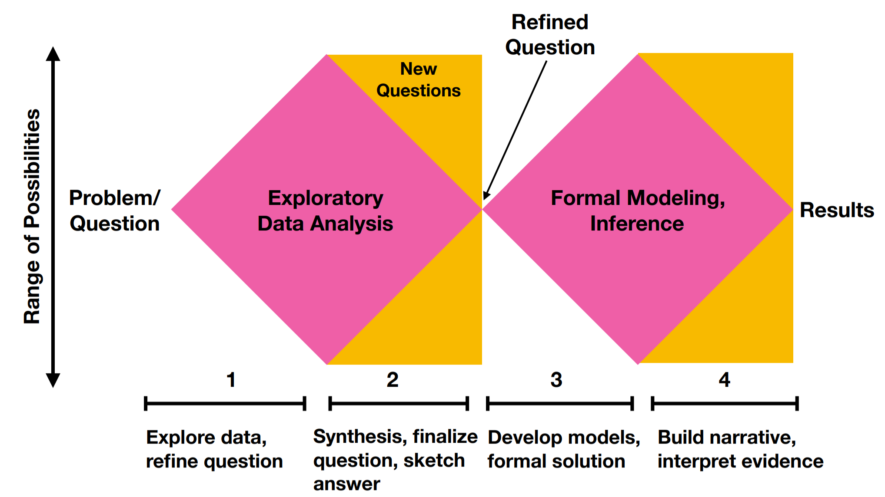
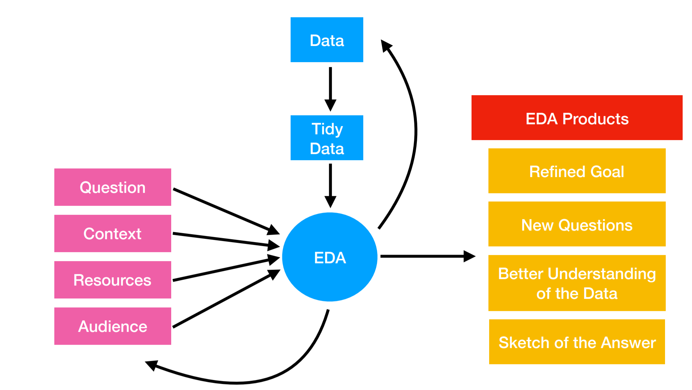
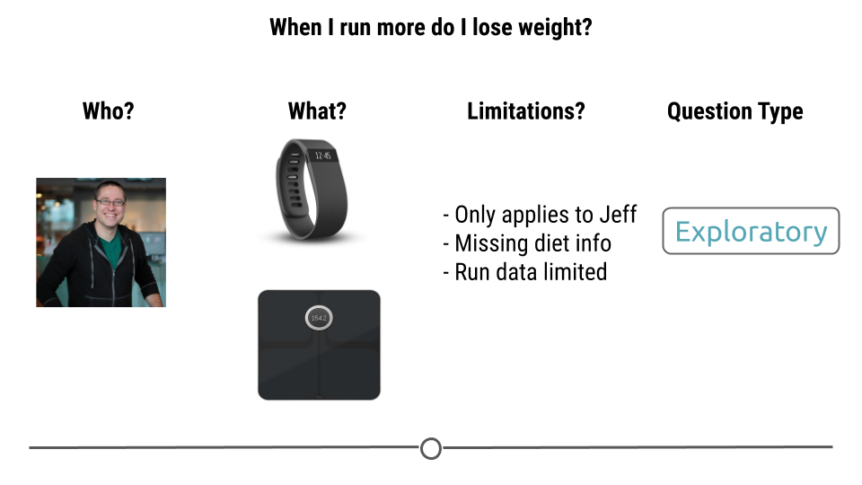
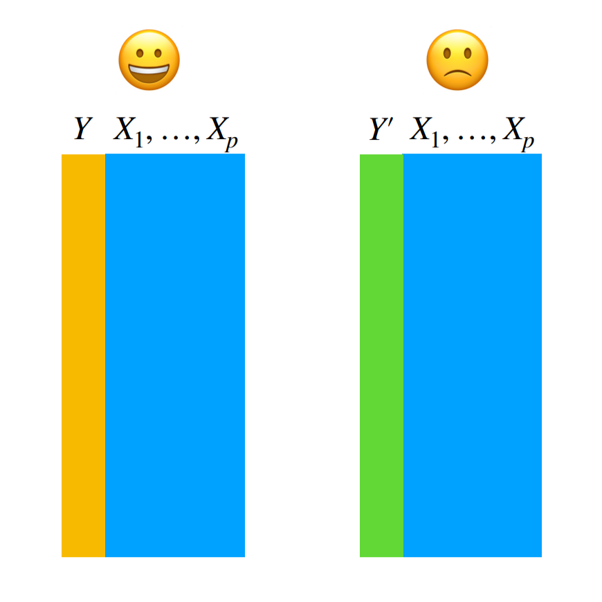
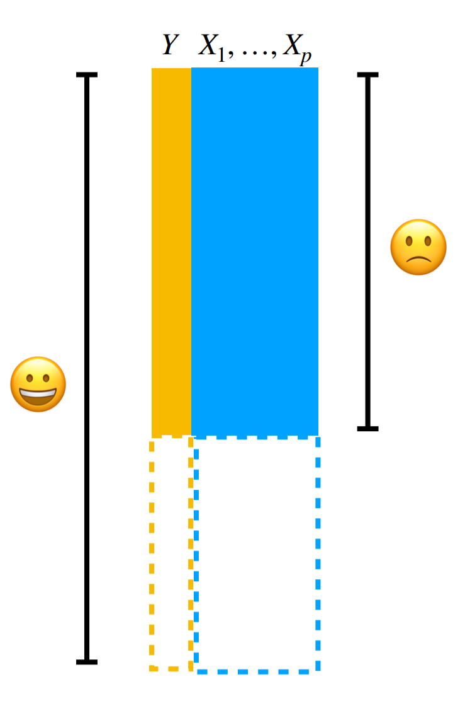
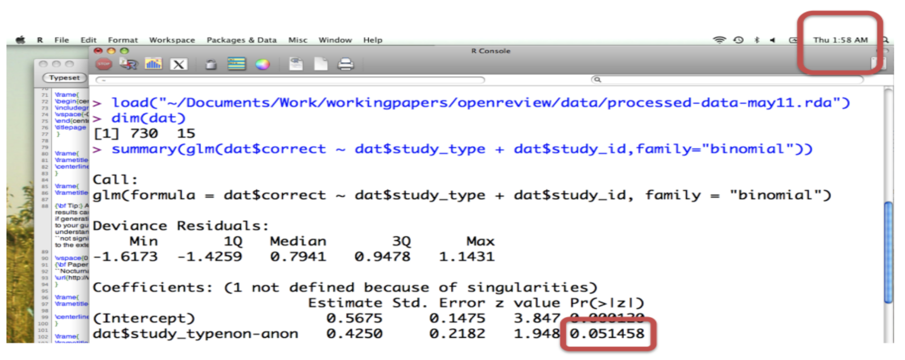
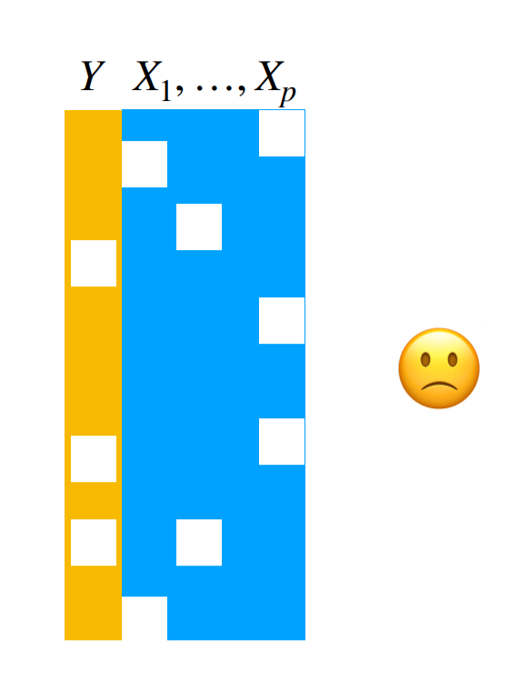
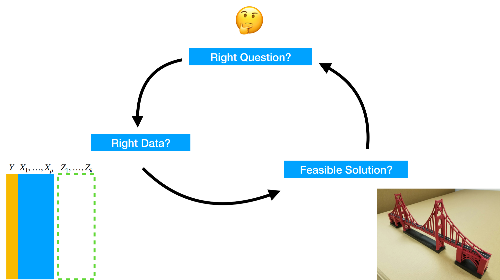

--- 
pagetitle: "Week 7 - Exploring data"
---

# Week 7

## Week 7 Learning objectives

:::keyidea

At the end of this lesson you will be able to: 

- Apply an exploratory data analysis framework to refine questions
- Apply an exploratory data anaylsis framework to identify data issues
- Organize your exploratory data analysis files
- Know and apply general exploratory data analysis principles
:::


## A framework for exploratory analysis 

> “Far better an approximate answer to the right
question, which is often vague, than an exact
answer to the wrong question, which can always be
made precise.” - John Tukey

Last week we talked about different ways of collecting data. Sometimes this will be an exercise you perform, and sometimes you will just be handed data from someone else. Regardless of how the data arrives the first step you will pursue in any data analysis is to explore the data to understand several things:

1. Do you have the right question? 
2. Do you have the right data?
3. can you sketch a solution to the question you care about? 


###  Do you have the right question? 

As we discussed back in [Week 1](http://jtleek.com/ads2020/week-1.html) the first and most important step in a data analysis is defining the question you want to answer. That sounds great in theory, but in practice, the question you set out to answer will almost inevitably change during the course of a data analysis. In his [blog post](https://simplystatistics.org/2019/04/17/tukey-design-thinking-and-better-questions/) on design thinking in statistics Roger lays out a phase diagram for data analysis. 


On the x-axis is the quality of the question. On the y-axis is the strength of evidence to answer that question. It is a common assumption that the data analysis question we are asking is "good" right from the start. So a data analysis is simply the process of moving along the phase diagram until you have strong evidence to answer the question. 

But in reality the question is often more dubious, vague, or not sufficiently clearly specified. This will be true both for questions you elicit from collaborators and for questions you define for yourself! The reason is it is really hard to define good data analytic questions that are concrete enough to answer, specific enough to support analytically, and still sufficiently interesting to merit attention. 

Statistics and machine learning - as they are usually defined - typically focus on building tools and techniques to improve the quality of evidence used to answer a question. Data science, on the other hand, usually involves both improving the question and providing evidence to answer that question. Not infrequently, improving the question will absorb more data analytic time than amassing evidence. 

The typical workflow for a data analysis involves one or more periods of exploration followed by a narrowing and problem definition for further analysis. 



In the first phase of an analysis you may start with a relatively specific question you want to answer. Exploring the data involves considering a range of possibilities - whether the data is good enough, whether it can answer the question you wanted to in the first place, whether there are potential issues that you didn't know about in advance. After a full exploration of the data you will again refine the question and sketch an answer. Then, the modeling phase of analysis will involve a second stage of exploration and consideration of different potential modeling choices resulting in a concrete answer to the question specified on the basis of your exploration that you can work to communicate. 


The middle phase (Phase 2 in the diagram above) represents an important moment in any analysis. Often a good exploratory analysis will be sufficient to give you a strong indication of whether a more complete analysis will answer the question you care about. This is a sort of [Pareto principle](https://en.wikipedia.org/wiki/Pareto_principle) of data analysis - which many have recognized. 

> “In my experience when a moderately good
solution to a problem has been found, it is seldom
worth while to spend much time trying to convert
this to the 'best' solution. The time is much better
spent in real research.”  –George Kimball, "A critique of operations research," J. Wash. Acad. Sci, 1958

Once you refine your question and come up with your first sketch of a solution, it is worth "trusting your gut" before devoting significant extra resources to detailed and complicated statistical modeling. Typically after an exploratory analysis you will have one of three feelings about the potential for answering your question. 

1. _You are unlikely to find a satisfactory answer with a formal analysis_ this is the case when there is limited signal, an obvious confounder, major data issues, or some other feature that makes the signal very difficult to find. In this case, it is worth considering whether fitting a complicated statistical model won't lead to over-interpretation of your data. Proceed with caution if your exploration leads you to this conclusion. 
2. _You aren't certain what the formal analysis will show_ this is the case when there appears to be some signal, the data are relatively well behaved, and you aren't entirely cretain what the answer will be after full statistical modeling. This represents a major fraction of data analyses and suggests that you should proceed as planned with your new question defined through your exploration. 
3. _The signal is obvious and clear_ this is the case when your original study is well designed, there is a lot of very clear data, or the signal is so abundantly clear it is hard to imagine an alternative explanation for the signal you see. Here the primary purpose of formal statistical modeling is both to summarize this signal and to spend some time thinking carefully about potential biases. If the signal is expected, and especially if it is surprising, it is worth being careful. As Daniel MacArthur [put it](https://www.nature.com/articles/487427a):
> Few principles are more depressingly familiar to the veteran scientist: the more surprising a result seems to be, the less likely it is to be true. 

The inputs to the data exploration are the question, context, resources and audience. When you complete your exploratory analysis the goals should be to have refined your existing questions, defined and settled on any new questions, and have a sketch for your ultimate statistical analysis. 




While this may seem like a single pass through the data often it is an iterative process between getting data, exploring your data, checking the data, refining hypotheses, and going back to the original data collection paradigm to validate. 

Ultimately you want to settle on a question that is 

1. _Specific_ - so your analysis will not be unwieldy 
2. _Not overly narrow_ - so that your data is sufficient to answer the question both in size and target. 
3. _Relevant _ - interesting either to you or your collaborators 

As an example you may be interested in the question of if you run do you lose more weight. But you might only have data collected on yourself and you might be missing certain key variables. You will want to consider what type of question you can answer and what the limitations might be. 




###  Do you have the right data?

Perhaps the key question in an exploratory analysis is to determine if you have the right data to answer the question. One of the key callenges is that the data you get in classrooms is much cleaner and easier to manipulate than the data you typically have to deal with in the real world. As Jenny Bryan put it in her JSM 2015 talk: 

> "Classroom data are like teddy bears and real data are like a grizzly bear with salmon blood dripping out its mouth."

When doing any exploratory analysis you want to confirm at minimum these five things. 

1. _Are the data good proxies for what you want to measure?_


Sometimes the data you collected don't measure what you wanted to in order to answer your question. You may be interested in income, but you only measured reported income. You may be interested in time to death, but you only measured intermediate outcomes. To assess whether you have the right measures:

- Understand the source of each of the measurements in your data set
- Compare them to the expectations you had when defining your question
- Identify any gaps between the source and expecations - there will always be a gap! However your job is to determine how far is too far and then document any potential issues for including as modifications of your later analysis. 

2. _Are there sufficient data, and the right type of data, to answer the question?_ 



This is the most common post-mortem on experimental data - you don't have enough or the right type of data to answer the question. This is a *very common* situation to have to navigate with collaborators and we will dedicate more discussion to how to handle that conversation in future classes. But be sympathetic, some day you might collect your own data (like [I did](https://www.ncbi.nlm.nih.gov/pmc/articles/PMC3212530/)) and find when you were analyzing the data in the middle of the night you didn't quite have enough: 



You should think through carefully not only if you have enough data, but enough of the kind of data you need. For example you may have a huge data set when performing survival analysis - but if you don't have enough observed events you won't be able to reliably detect statistical signals. 


3. _Are there obviously missing pieces of information that could be confounders or modifiers?_ 


This is probably the trickiest one to evaluate. It generally involves considering the context of the problem very carefully. For example, if you've collected information on the relationship between drinking and incidence of cancer - it might be important to consider smoking as a confounder. You might only know that from the context of the problem. In terms of exploratory analysis of data the presence of a missing covariate is most often observed by an unexplained pattern or clustering in the data. For example this plot of Covid-19 cases


Shows a regular, repeating spike. If all you had was the counts, you might think there must be an underlying variable you haven't collected that might explain such an important signal (in this case it is likely the [weekend effect](https://www.bbc.com/news/health-52167016) in counting). 

This might be the only type of indicator you have a missing variable so worth keeping an eye out for. 


4. _Are there any patterns of missing data among the measured variables that might cause problems for an analysis?_



This type of missingness is somewhat easier to detect. Mostly because you can count whether there are NA or missing values. The tricky thing is to determine *why* those data are missing and whether it is related to the variables you care about. [This](https://www.ncbi.nlm.nih.gov/pmc/articles/PMC4121561/) is a relatively nice explainer of the types of missingness. The ideal (and often untestable) case is where the data are "missing completely at random" - in other words they aren't missing in a way that correlates with any of the variables you care about. Slightly less good, but still ok, is if the data are "missing at random" where the observed variables can explain the systematic missingness patterns. Finally, "missing not at random" could spell significant trouble for your analysis since there are systematic patterns to the missing data, but they can't be explained by the variables you have. 

Again, as with the missing variables, you may need to explore the data carefully to try to observe patterns of variation in missigness that may be important for your analysis. 


5. _Do the data have obvious errors that could increase bias or uncertainty?_


There are a [very large number of ways data can be wrong](https://github.com/Quartz/bad-data-guide). Sometimes these errors will be blazingly obvious. Sometimes they are exceedingly subtle. The key is to understand thoroughly and completely not only the code book for the variables but also the data themselves. Counting, visualization, and comparison to quantities you know must be true can help identify problems in a data set. But it is almost impossible to be 100% sure you have caught everything. 


### Can you sketch a solution to the question you care about? 

Once your data have been organized and you've explored them for the obvious issues above, the last component of any exploratory data analysis is to sketch a solution to your primary questions. This sketch may be as simple as a table or a plot - possibly with a statistical model in mind. It will often tell you 80% of the answer - even if that basic sketch is rarely shown to others or included in your final analysis. Think the lego bridge, not the real one. 


When you are making this sketch you might identify new issues with the data, or modifications to your question. So you may have to cycle between these steps. 




As John Tukey said:  

> The value of a plot is that it allows us to see what we never expected to see.”

So while you are performing an exploratory analysis you should be constantly resetting your expectations to compare them to the summaries and plots of the data you are making. 


You can use statistical models to help explore data as well. Typically these are stripped down versions of the model you will ultimately fit. Keep in mind that models quantify the expectations you have for the data, but won't necessarily reveal what is unexpected. When exploring with models it is critical to overlay the data on any model fits you may calculate. 


## Some general EDA principles


### Check the packaging

* What can you learn about the dataset before looking directly at the data?
        - Check codebooks
        - Ask questions
        - Read up on the data collection procedure
* Check on structure and format
        - Is the data a rectangle? If not look at the files/check the DB
• Check metadata; are all variables there that you expected?
        - Compare the codebook to the data files you have
        - Make sure you have all the files you need
• Are all metadata present?
        - Make sure there is a codebook
        - Make sure all the dates, times, and data types match up


### Rectangle your data 

Some data sets will come in as "rectangles" - easy to manage data sets (possibly tidy already) that you can directly use in R. But some spreadsheets will have extra header rows, JSON files will read in as lists, databases may have multiple tables you need to join. The first step toward exploring your data is often "rectangling" the data. At this stage, it doesn't have to be [tidy data](https://vita.had.co.nz/papers/tidy-data.pdf). You may split out rows or columns, clean up values, spread your data set out, or make it into a long, narrow table. But most data analytic operations in terms of plotting, counting, and more rely on rectangled data. So this is often a good first step. 

### Look at the top and bottom

- Check the first few rows
        - Do the values match expectations?
        - Are the right variables present? 
- Check the last few rows; make sure all rows were
read properly and there’s no crud at the end
        - Are there weird values at the end? 
        - Missing values? 
        - Corrupted file endings? 
- Time/Date data often sorted; make sure all dates/
times are in appropriate range


### Always be counting

- Count various aspects of your dataset
        - Number of rows
        - Number of columns
        - Number of levels of factors
        - Number of missing values
- Compare counts with landmarks
        - Does the row number match the sample size?
        - Do the number of columns match your number of variables?
        - Are there less than or equal to 31 days per month? 
- Number of subjects (unique IDs), number of visits
per subject, number of locations, number of
missing observations, etc.
- Always be counting at every phase (“checking
mindset”)
        - Assume the data may have errors!

### Make a plot

Actually make a *ton* of plots. You can't have too many exploratory plots. Go overboard, most of these will be left on the cutting room floor. Plot every variable, plot most of the comparisons between pairs of variables. Consider heatmaps and other multi-variable plots as well. 

- Plots show expectations and deviations from those
expectations (i.e. distribution mean and outliers)
- Tables generally only show summaries, not deviations; also everything on the same “scale”
- Draw a “fake plot” first - set your expectations


### Validate with an external data source

- Compare your data to something outside the dataset
- Even a single number/summary statistic comparison can
be useful
        - Is the range of values what you'd see in the literature?
        - Is the number of observations plausible for this type of data?
- Compare your measurements to another similar
measurement to check that they’re correlated
        - Get external upper/lower bounds
        - Ex: number of people should exceed total population
        - Ex: Check for negative values when they should be positive


### Try the easy solution

Before you fit a complicated statistical model, try the easiest possible solution. Are you looking for a correlation? Just plot x vs y and see what it looks like colored by various potential confounders. Are you looking for a trend over time? Plot the variable vs time and look for patterns and deviations. Are you looking to compare the mean of two groups? Make a boxplot. 

- First step in building a primary model
- Build prima facie evidence
- Basic argument, without nuance (that comes later)
- Maybe just one plot (or table)

### Follow up

- Do you have the right question?
        - Questions often change once you see the data
        - Typically the scope narrows 
- Do you have the right data?
        - Sometimes you might realize you don't have the data to answer your original question
- Do you need other data?
        - Can you find it? Or is it better to treat this as a limitation
- Could you sketch the solution?
- Is there signal in the data?
        - From painful experience, if you don't see much in the first pass simple analysis, it is often hard to find it even with *much* more effort. 
        
## Organizing an EDA

When performing an EDA, I typically create one or more analysis files. Often my files are placed in the

- code/
        - raw_code/
        
folder with most of my plots being saved to

- figures/
        -exploratory figures
        
I generally try to name my files in an order that I hope will make sense later. So something like:

- 0_data_pull.R
- 1_first_plots.R

I generally use .R files (not Rmd files or Jupyter notebooks) since I will likely be moving fast and don't have a lot of time for formatting. One thing I like to do is add comments when I find something interesting with words I hope will be searchable later. So something like:


```r
#########
### Interesting correlation between x and y
######### 
cor(x,y)
```


        

## Additional Resources

:::resources
* Karl Broman [Lecture on Data Wrangling](https://kbroman.org/AdvData/16_wrangling.pdf)
* Roger Peng [Lecture on EDA](https://jhu-advdatasci.github.io/2019/lectures/EDA.pdf)
:::


## Homework 

:::homework
* __Template Repo__: https://github.com/advdatasci/homework7
* __Repo Name__: homework7-ind-yourgithubusername
* __Pull Date__: 2020/10/12 9:00AM Baltimore Time 
:::
