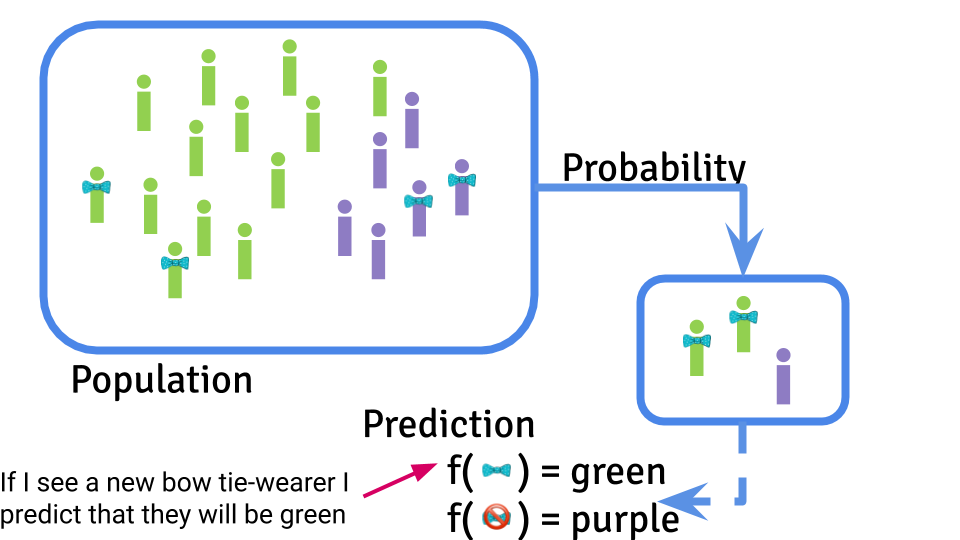
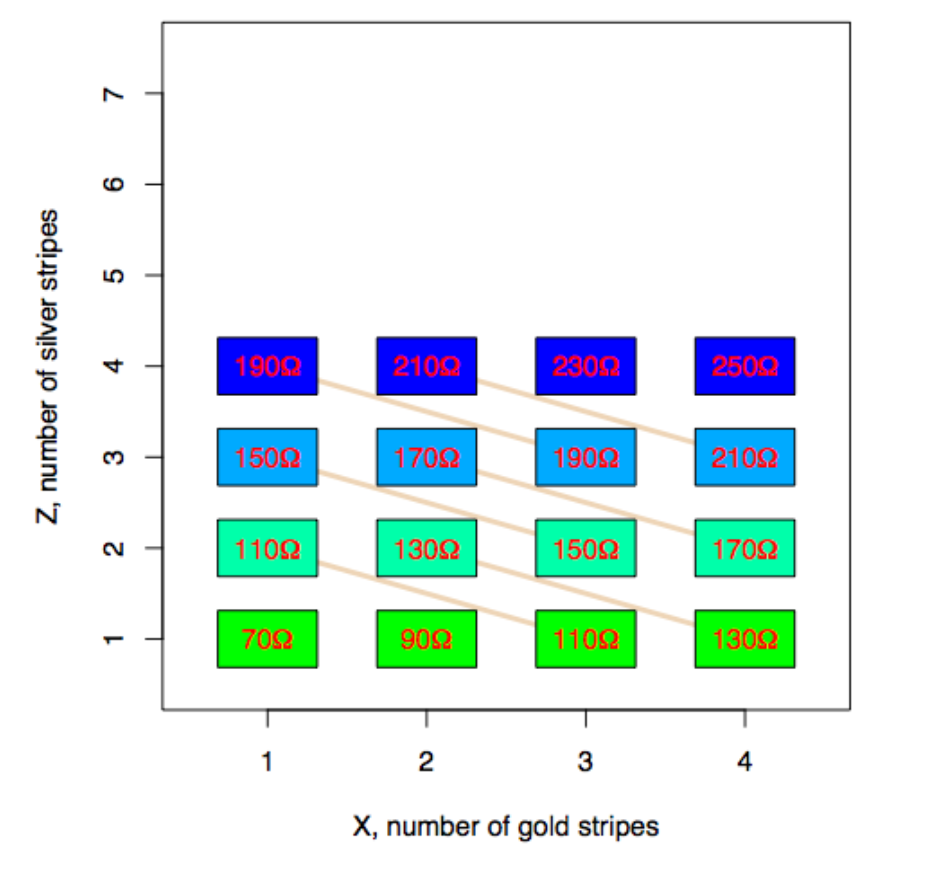
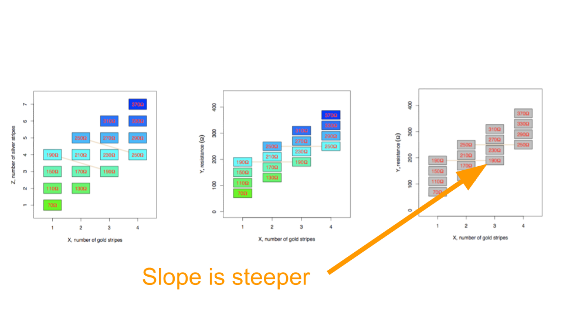
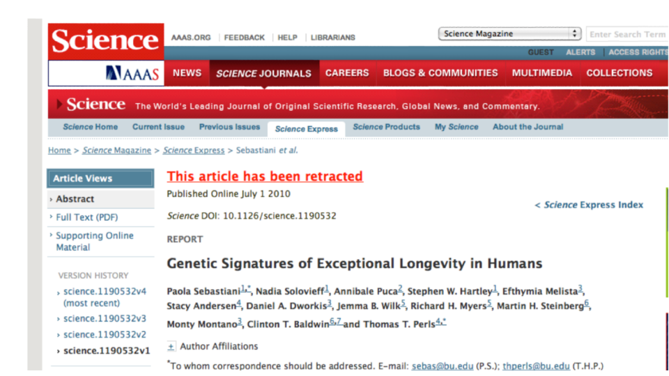
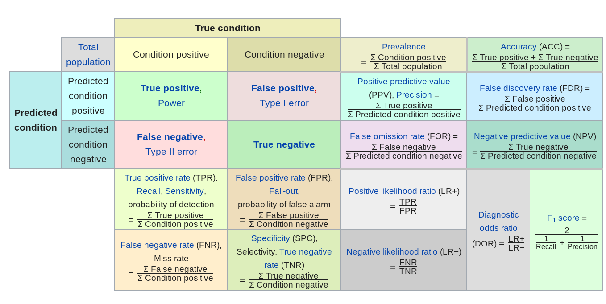

--- 
pagetitle: "Week 8 - Modeling data"
---

# Week 8

## Week 8 Learning objectives

:::keyidea

At the end of this lesson you will be able to: 

* Define the central dogmas of prediction and inference
* Identify the key components of a modeling process (signal, systematic noise, random noise)
* Apply the steps in statistical modeling for data science
* Know how to use "wrong" models to get correct inference for specific trends 

:::


## A framework for modeling

Statistical modeling and machine learning are often considered the key components of data science. There are entire courses in our department at the Johns Hopkins Bloomberg School of Public Health and across all of academics focused squarely on these topics. We aren't going to try to cover these whole topics in a single lecture! Instead, our focus is to cover the key concepts and ideas behind how you can fit the tools you already know into the data science process we have been learning about over the course of this class. 

In last week's lecture we covered the principles of exploratory data analysis (EDA). The goal of EDA is to familiarize yourself with the structure, quirks, and potential flaws in the data set. The final step is an initial "sketch" for the statistical modeling approach that you plan to use. While it is easier to teach data munging, exploratory data analysis and statistical modeling as separate lectures in a course, the reality is that these components form a tightly interconnected feedback loop. 

The statistical modeling component of this feedback loop focuses on creating a precise quantification of both the signals in the data set and the uncertainty we may have about those signals. To do that we deploy a variety of mathematical models but at the heart of these models is a goal to understand the way the world works. So the mathematical models you use, whether for statistical inference, prediction, or causal inference should be developed with the understanding they are part of the overall arc of the data analytic story. 

There is a [famous phrase](https://en.wikipedia.org/wiki/All_models_are_wrong) in statistics: 

> All models are wrong, some are useful - George Box

Like "correlation does not imply causation" this is a pithy phrase that gets tossed around a lot. But what does it actually mean? It means that when we are doing statistical analysis or machine learning it will be nearly impossible for us to get all of the right variables in the equations in all of the right forms. This means that no matter how hard we try our model will be "wrong". But if we are careful about how we interpret the model - quantifying important trends and documenting artifacts and uncertainty - we can say something about the way the world works. So the model may be "useful". 

It is helpful to remember when performing statistical modeling that the goal isn't to quantify the "truth". The goal is to fairly represent a summary of the trends in the data. 

### Identify your goal

We discussed the different types of statistical questions in the first lecture of this course: 


You can use statistical models to address any of the types of questions, from descriptions of the data to mechanistic models. However, for this lecture we will  on statistical inference and statistical prediction (sometimes called machine learning). These are the two most popular data analytic tasks; moreover most other types of analysis rely on the same models used for either statistical inference or machine learning with the addition or subtraction of some assumptions. 


#### Statistical inference 

The goal of statistical inference is to report sources of "signal" in a data set, while documenting and accounting for both systematic and "random" sources of errors. Just as there is a [central dogma of molecular biology](https://en.wikipedia.org/wiki/Central_dogma_of_molecular_biology) there is also a central dogma of statistics, which I first saw coined in Josh Akey's [lecture notes](https://www.gs.washington.edu/academics/courses/akey/56008/lecture/lecture1.pdf):


Statistical inference is focused on using probability to sample from a population, take measurements on that sample, and use the samples to infer something about the characteristics of the population _on average_. 

The characteristic of the population you are estimating is called a _parameter_ and you use a _statistical estimate_ to try to guess what that parameter might be. You can then use the information you have about sources of uncertainty to infer how accurate and precise you think your estimate will be. 

#### Machine learning

The goal of machine learning is to use a data set to create a prediction function that can be used to predict a new value of the outcome on the basis of a set of input features. 



The central dogma of machine learning is similar to the central dogma of statistics in the sense that you are performing a statistical calculation the basis of some observed data. However, the goal is ultimately here to create an algorithm that will make predictions for new data values. This prediction will ultimately also be subject to potential artifacts, sampling bias, and noise. However, the target is creating an accurate prediction function and typically the error is measured by how close the predictions are to the truth. 

#### Internal "study design"

It is important to know your statistical analysis goal in advance. It has implications for most of the steps in your analysis. For example, with statistical inference you may choose more parsimonious models that are easier to understand and interpret; whereas for machine learning you may choose more sophisticated non-linear models if they improve prediction accuracy. 

One of the most important distinctions occurs right at the beginning of the analysis. If you are performing an inferential analysis you typically analyze the entire data set together at once, with the goal of making an estimate of uncertainty using the whole sample. When performing a statistical prediction or machine learning analysis you typically separate the data into training, testing, and validation sets so that you can build the statistical prediction in the training set, tune it in the testing set, and get an independent estimate of how well it works in the validation set. 

### Form an analysis plan

When you perform a statistical analysis you should start with a plan. This plan can be as simple as a list of steps and models you plan to perform or it can be as complicated as a complete set of code. But the important part is that you should _write your plan down in advance_. You can write down a very high level sketch of your analysis before you even begin exploration and a second, more thorough, analysis plan after you complete exploration. 
This is a particularly important step to complete if you have a complex, or high dimensional data set, if you have a vested interest or motivated collaborators who want the data to say something in particular, or if you are worried about over interpreting your data. The purpose of the analysis plan is to help you document all the post-hoc decisions that you made when analyzing your data. This documentation will allow both you and your collaborators or bosses to evaluate whether the decisions may lead to bias in your analysis. 

"Researcher degrees of freedom" is a term that was invented to refer to all the ways that you, as the analyst, can manipulate or change your analysis plan to try to reach a conclusion you already wanted in advance. The [title of their paper](https://journals.sagepub.com/doi/10.1177/0956797611417632) included the statement: 

> ...Undisclosed Flexibility in Data Collection and Analysis Allows Presenting Anything as Significant

They were specifically referring to statistical significance in the sense of identifying results with a P-value less than 0.05 as statistically significant. However, this same type of flexibility can lead to over-optimism in prediction, biased estimates, and generally incorrect analysis if they are not appropriately accounted for. So it is worth writing down an analysis plan you can compare to later when you set off to analyze any new data set. 

### Model signal

When you perform your exploratory analysis you will be looking for the "signal" in the data set. What is a signal? Typically we think of signal as the relationship between one or more variables. For example if you are looking for a relationship between x and y then the "signal" here is pretty obvious. 


```
## 
## Attaching package: 'dplyr'
```

```
## The following objects are masked from 'package:stats':
## 
##     filter, lag
```

```
## The following objects are masked from 'package:base':
## 
##     intersect, setdiff, setequal, union
```


In fact, in this case the data are generated from the model:

$$ y  = x^3 + e$$ 

where $x \sim N(0,1)$ and $e \sim N(0,1)$. What we call the "signal" is the systematic relationship between $x$ and $y$ - so the $x^3$ part of the equation above. This represents the [typical](https://www.tandfonline.com/doi/full/10.1080/01621459.2020.1762613) relationship statisticians use to model data - they think of modeling a "surface" where the surface represents some simple function of the data with a noise term. In this case we might fit a model of the form: 

$$ y_i = f(x_i) + e_i$$ 

where $y_i$ is the $i$th data point, $f$ is a function relating $x$ to $y$ and $e_i$ represents unmodeled "noise" - which may be assumed to be random. In our simple example the function $f(x) = x^3$. When performing inference - or any statistical modeling - there is a tradeoff between simplifying interpretation and trying to capture the signal as precisely as possible. 

On the simple side of the scale, a default reaction for most data analysts is to start with a linear model. It is often a reasonable first summary of the data. 


```r
library(modelr)
lm1 = lm(y ~ x, data=dat)
dat = dat %>%
        add_predictions(lm1)

dat %>% 
 ggplot(aes(x = x,y=y)) + 
        geom_point(color="grey") + 
        geom_line(aes(x=x,y=pred),color="black") + 
        theme_minimal()
```


Here this doesn't seem to capture the entire relationship between $x$ and $y$. But remember "all models are wrong...". We can _still think about the linear relationship between x and y even if it isn't the perfect model for the signal_. In particular, this model has the form: 

$$y_i = \beta_0 + \beta_1 x_i + e_i$$ 


Where $\beta_0$ is the average value of $y$ when $x = 0$ and $\beta_1$ is the average increase in $y$ for a one unit increase in $x$. In this example we get parameters estimates for each of the terms: 


```r
library(broom)
```

```
## 
## Attaching package: 'broom'
```

```
## The following object is masked from 'package:modelr':
## 
##     bootstrap
```

```r
lm1 %>% tidy()
```

```
## # A tibble: 2 x 5
##   term        estimate std.error statistic   p.value
##   <chr>          <dbl>     <dbl>     <dbl>     <dbl>
## 1 (Intercept)   0.0173    0.0888     0.195 8.46e-  1
## 2 x             3.28      0.0891    36.8   3.83e-188
```

So far so good. Remember, this line doesn't _perfectly_ represent the signal between $x$ and $y$. But it does represent our best estimate of the linear trend. Let's imagine that we could sample an infinite number of points. With infinite data you might get something that looks (approximately) like this: 


```
## 
## Attaching package: 'MASS'
```

```
## The following object is masked from 'package:dplyr':
## 
##     select
```


This limiting case of infinite data is called the "super population". You can think of applying the same linear regression model to this infinite super population of data. If you do, the $\beta_1$ you get is the "parameter" you are estimating. The coefficient $\beta_1$ when fit to this infinite data is the exact value we are trying to estimate with our regression model. 

This seems pretty convoluted. In this case we can tell what the signal is exactly. So why think about the super population and define the parameter estimate as the "linear trend we would have observed in an infinite sample of data"? The reason is that while this case is simple and we know the true signal, we rarely will. So we are almost always using a summary of the data calculated with some simplified model. It is useful to think about what that model is trying to capture and what the result would be if we applied that summary to a data set where we could perfectly capture the same trend. 

The advantage of this approach is simple. If we are estimating the linear trend in this data, it does exist in the limit and when we get a parameter estimate we can interpret it easily:  is the average change in $y$ values for a one unit change in $x$ values. 

An alternative approach to capturing the "signal" is less focused on _attribution_ of the signal to a particular trend and more focused on capturing the most accurate representation we can with our simplified model. In that case we might fit a smooth function to the data.  There are a number of ways to [fit a smoother](https://rafalab.github.io/dsbook/smoothing.html) but one example is to fit a [generalized additive model](https://rafalab.github.io/pages/649/section-10.pdf). These models break what might be a complicated function of multiple variables:

$$ y = f(x_1,x_2,...,x_n) + e$$

and simplify them by assuming the terms are additive: 

$$ y = f(x_1) + f(x_2) + ...+ f(x_n) + e$$

Where the $f()$ functions can be as complicated or as simple as we like. We can fit this kind of model using the `gam` R package. 


```r
library(mgcv)

gam1 = gam(y ~ s(x),data=dat)

dat %>% mutate(smooth = gam1$fitted) %>%
  ggplot(aes(x, y)) +
  geom_point(size = 3, alpha = .5, color = "grey") +
  geom_line(aes(x,smooth), color="red")
```


Here we "capture" the signal much better. But the resulting interpretation is a little bit harder. We have a smooth term (the $f()$ function), with an estimated number of degrees of freedom (a term describing how flexible the $f()$ function is). 


```r
gam1 %>% tidy()
```

```
## # A tibble: 1 x 5
##   term    edf ref.df statistic p.value
##   <chr> <dbl>  <dbl>     <dbl>   <dbl>
## 1 s(x)   8.86   8.99     1988.       0
```

This term doesn't have a neat interpretation of "a one unit change in x leads to a change of $\beta_1$ in y". Instead, we have to carefully describe the function and interpret what it means for the data. 

Typically, when modeling even complicated data sets, it makes sense to start out with the simple linear regression models. Fitting these models does not imply you think that the signal has a linear form - you are simply calculating a specific summary of the data. Then, if the simple linear models do not represent sufficiently useful summaries you can build more complicated models for the signal - carefully considering how you will interpret the resulting functions you estimate. 


### Account for artifacts

We typically think about the noise in a statistical model being random. However, they don't have to be! Let's take a really simple, totally deterministic example and show how the signals in the data can be due to unmeasured, systematic factors. This example was borrowed from [Ken Rice](http://faculty.washington.edu/kenrice/)'s linear models class. Imagine we have some [resistors](https://en.wikipedia.org/wiki/Resistor) that can be of one of two types - gold (whose resistance we denote $X$) and silver (whose resistance we denote $Z$). Our outcome is the total resistance $Y$.  


In this case everything is fully deterministic. If you show the resistance of gold versus the resistance of silver you see that they exactly add. 




We can make this look like "data" by simply plotting the values of the total resistance vs the number of gold striped resistors (middle panel) and then remove the coloring corresponding to the silver striped resistors (right panel) you get something that looks like regression data. 


If you fit a regression model to this data it will give you the "right" estimate for the amount of resistance in each gold striped resistor. 

However, if instead we have a design where the number of gold and silver resistors are related by an unknown relationship (left panel) and perform the same process by plotting the total resistance versus the gold stripes (middle panel), and removing the silver stripe information (right panel) - it still looks like a regression model! But the underlying, missed variable here causes big problems - since the slope of the regression model is now too big and it "looks" like the gold resistance stripes have a larger resistance on average than they do:



Remember, nothing was random here! The "data" are totally deterministic. But it helps to show how regression models can produce inaccurate results when you have artifacts in your data. This is an example of a [confounder](https://en.wikipedia.org/wiki/Confounding) but as you will know from your epidemiology classes there are a number of ways that unmeasured variables can have an impact. 

When you model your data there are two ways you can look for artifacts:

1. Look for relationships among the measured variables that might impact your results. The best way to do this is to plot the outcome you care about versus the predictor you care about. Then color the points by other variables and look for patterns. For example if you see something like this:


```r
library(tibble)
library(ggplot2)
library(dplyr)
set.seed(1234)
dat2 = tibble(x = rnorm(1000), 
             z = rnorm(1000,mean=rep(c(1,-1),each=500)),
             y = rnorm(1000,mean=x+z))


dat2 %>%
  ggplot(aes(x=x,y=y)) + geom_point() + theme_minimal()
```


It might seem like your regression model is fine. But if you color by the third variable: 


```r
library(viridis)
```

```
## Loading required package: viridisLite
```

```r
dat2 %>%
  ggplot(aes(x=x,y=y,color=z)) + 
  geom_point() + 
  scale_color_viridis() + 
  theme_minimal() 
```


You can see all of the values at the top of the plot have high levels of z and all the values at the bottom have low levels of z. This suggests z is an important variable to consider when you are modeling. 

2. Look for the "unknown unknowns". This is a bit trickier, since you don't have an obvious pattern to look out for. For example, in the data above, if you didn't know z, the plot would look like there was a pretty reasonable linear regression fit to the relationship between y and z. However, there are a few tips you can use to look for "unknown unknowns":
    - For any variable measured over time, plot that variable versus time, day of the week and month of the year to look for clustering or seasonal patterns. 
    - Look at pairs plots of variables and look for non-random patterns or groupings within the pairs of variables. 
    - Look for any variable that might have a multi-modal distribution - especially if there isn't another variable in your data set that might explain the groups. 
    - If you have high-dimensional data look at dimension reduction techniques (we will discuss this more later)
    - Plot residuals from regression models and look for patterns in the residuals     - Look for differences in variability among groups or across continuous variables 

For example, if we plot the residual histogram from the simple regression of y on x, you might start to notice that it looks a little strange - with something going on that might indicate a missing variable: 
    

```r
lm2 = lm(y ~ x, data=dat2)
dat2 %>% 
  add_residuals(lm2) %>%
  ggplot(aes(x=resid)) + geom_histogram() +  theme_minimal()
```

```
## `stat_bin()` using `bins = 30`. Pick better value with `binwidth`.
```


The danger of unknown unknowns is extremely real. There have been multiple papers that have had to be retracted because very good data analysts simply missed a variable that was important. For example - there was a famous paper linking genetic variation to human longeviity - it was ultimately retracted because the sample processing time appeared to be a major confounder of the analysis. However, this was a variable not necessarily known to the authors at the time of writing the paper:  



In my experience one of the best ways to detect a missing variable is to be suspicious when signals I am looking for are "too strong". By too strong, I mean if I find a signal in a data set where the estimate is double or more the next closest I have seen or seems pretty unrealistc - then I immediately get suspicious there may be a hidden relationshp driving that signal. 


### Build models up sequentially

When building statistical models for practical problems, the data is usually already pretty complicated. It helps to not over complicate your analysis unless it is necessary. It is a good idea to start with a univariate model or the simplest model you can imagine and then sequentially build up layers of variables. When you perform an analysis like this you shouldn't perform _inference_ on each of these sub-models, rather it should be viewed as an exploration of the data to create a regression model that best explains signal, systematic noise or artifacts, and random noise. There is a very nice chapter on sequential model building in the [R for Data Science Book](https://r4ds.had.co.nz/model-building.html)


### Model uncertainty

Uncertainty modeling depends on the type of modeling you are doing. Here we will break down the potential error measures used for statistical inference and statistical prediction. For other applications (such as causal inference) there are often similar error measures used but the interpretations vary somewhat. 

#### Uncertainty for inference

Recall that the central dogma of statistical inference is to say something about the population based on the sample you have taken. Typically by the time you are down to modeling uncertainty you have accounted for the main sources of signal as well as systematic artifacts. 

The remaining sources of noise _may be due to unmodeled variables or due to "random" noise_. Regardless, the purpose of uncertainty modeling is to tell you something about what is going on in the population. There are two types of uncertainty measures typically used for inference:

1. _Estimation uncertainty_ - are measures of uncertainty designed to tell us something about the values of parameters we care about. Typical examples are confidence or credible intervals for parameters of interest. The goal here is to say something about the most likely range for a parameter. It is highly recommended to include these, particularly if you only care about one or a small number of parameters. 

2. _Decision uncertainty_ - are measures that help us decide whether a signal is "real". Examples include p-values, Bayes factors, and posterior probabilities for decision rules. These measures have [fallen out of favor](https://www.amstat.org/asa/files/pdfs/P-ValueStatement.pdf), largely because of [Goodhart's law](https://en.wikipedia.org/wiki/Goodhart%27s_law):

> When a measure becomes a target, it ceases to be a good measure

However, I still believe these types of measures [can be useful](https://simplystatistics.org/2012/01/06/p-values-and-hypothesis-testing-get-a-bad-rap-but-we/) largely because it is often important to make decisions about whether you think an effect is "real" or not when reporting your results. 

Regardless of the uncertainty measure you use, the goal is to say something about the population at large. However, we are working with a sample so all of these uncertainty measures should be understood in that context. In particular a few things to keep in mind when reporting uncertainty measures:

1. All uncertainty measures are sample size dependent. If you have a huge sample size your p-values will be tiny even for negligible signals - you will also have ultra tiny confidence intervals. This also applies to Bayesian measures of uncertainty. 

2. All uncertainty measures assume that there is no hidden systematic variation. If there is such variation and you have missed it in the modeling step, the uncertainty measures will no longer be accurately calibrated. 


3. Uncertainty measures, like estimates, vary from sample to sample. This means that its worth considering in your interpretation that the uncertainty estimate is dependent on the sample and may vary from sample to sample. 


#### Uncertainty for machine learning

The central problem in machine learning can be thus written very simply as minimizing a distance metric. Let $\hat{Y} = f(\vec{X})$ then our goal is to minimize the distance from our estimated function of the predictors to the actual value. 

$$d(Y - f(\vec{X}))$$

$d(\cdot)$ could be something as simple as the mean squared distance or something much more complex. Perhaps the most important part of any machine learning problem is defining what success looks like. This choice very much depends on the application and what you are trying to do. 

For example, when we talk about the goal in ML we are usually talking about the error rate we want to minimize and how small we want to make it. Consider for each observation we have an outcome $y$ and a set of features $\vec{x}$. Our goal is to create a function $\hat{y} = \hat{f}(\vec{x})$ such that the distance, $d(y,\hat{f}(\vec{x}))$, between the observed and the predicted $y$ is minimized. 

The two most common distances that show up in machine learning (and the ones you'll always be using if you don't change the defaults!) are: 

- **Root mean squared error (RMSE)** - this is the most common error measure for regression (read: continuous outcome) problems.
    - $d(y,\hat{f}(\vec{x})) = \sqrt{\sum_i \left(y_i-\hat{f}(\vec{x}_i)\right)^2}$
- **Accuracy** - this is the most common error measure for classification (read: factor outcomes) problems. 
    - $d(y,\hat{f}(\vec{x})) = \sum_i 1\left(y=\hat{f}(\vec{x})\right)$
    
Here we are going to use simple accuracy and say that anything better than guessing is "good enough".

But in general there are a number of other potential error measures: 



Here are a few examples of how they might be relevant. 

- **Predictive value of a positive** - in classification if one group is much less frequent than another, then even high sensitivity/high specificity tests can produce lots of false positives (the classic example is cancer screening, but very relevant for any screening problem). 
- **Mean absolute error** - in regression sometimes you want your error to be less sensitive to a few outliers (this might be true in predicting highly skewed outcomes like income or property values) and MAE can reduce the influence of those outliers. 
- **Specificity** - when the cost of a false negative is really high compared to a false positive and you never want to miss any negatives (say for example missing a person standing in front of a self driving car)

In general you need to spend a good amount of time thinking about what the _goal_ is, what the tradeoff of various different errors are and then build that into your model. 

### Compare to your analysis plan 

When you perform an analysis you will invariably have to make a large number of choices that weren't in your analysis plan. There is understandably a lot of attention on multiple testing problems. Usually when people talk about multiple testing, they are focused on the documented tests included in an analysis. But there are a few levels of potential multiple testing in a data set:  

- __Multiple testing__ - _Considering multiple hypotheses. Often refers to a fixed set of hypotheses._
- __[Garden of forking paths](http://www.stat.columbia.edu/~gelman/research/unpublished/p_hacking.pdf)__ - _Considering many analysis decisions, often without quantifying how many decisions are made_
- __[P-hacking](https://journals.plos.org/plosbiology/article?id=10.1371/journal.pbio.1002106)__ - _Considering many analysis decisions, with a metric in mind and trying to optimize that value_

Quantifying multiple testing where your models are documented is pretty straightforward. You can use techniques like the Bonferroni correction or the Benjamini-Hochberg method for false discovery rate control. 

However, this often represents the smallest part of the variation in decision uncertainty quantification. Generally there is an iceberg of decisions that have been made before a p-value is calculated that could impact the uncertainty measure:


The best way to combat this issue is to document the choices you made throughout the analysis and in particular, compare them to your original analysis plan. If you include this documentation with justifications for your modeling decisions it will both provide a way for you to hold yourself responsible as well as to help others evaluate your data analytic process. 


### Understand incentives

Once you begin to put things in concrete terms the incentives behind a data analysis typically become much more clear. For example:

- You may want to find a result to make a paper publishable
- Your collaborator may be looking for a result to make a paper publishable
- Your boss may want you to show you can predict sales to justify the data science team
- Your analysis may underly important decisions that are already being made or have been made

It is difficult to navigate these as a data analyst.At a basic level it is important to be aware what these incentives are and have a plan for navigating those incentives while accurately representing what is going on in the data.  As we discussed earlier, you can put together a 'successful' data analysis by addressing these incentives directly. However, it is better to accuratley represent what is in the data since the consequences - paper retractions, misallocated resources, or poor decisions - can result. We will discuss more the ways this plays into data analytic relationships later in the course. 


## Additional Resources

:::resources
* [Roger Peng's post on partioning variation in a data set](https://simplystatistics.org/2018/07/23/partitioning-the-variation-in-data/)
* [Rafa Irizarry's Lecture on Regression Models](https://rafalab.github.io/dsbook/linear-models.html)
* [Jeff Leek's lecture on multiple testing](https://docs.google.com/presentation/d/1HZLts6gBiTfBT09Zck7vlPAAb988gD_Ni45PCoBjUkQ/edit?usp=sharing)
* [Model Buidling from the R For Data Science Book](https://r4ds.had.co.nz/model-building.html)
:::


## Homework 

:::homework
* __Template Repo__: https://github.com/advdatasci/homework8
* __Repo Name__: homework8-ind-yourgithubusername
* __Pull Date__: 2020/10/26 9:00AM Baltimore Time 
:::
